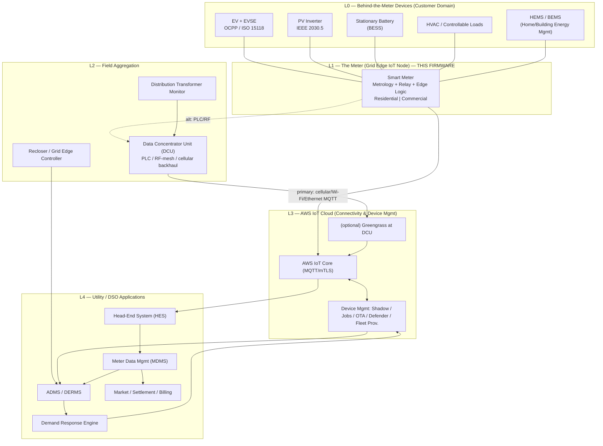
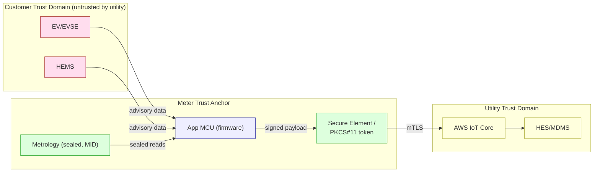

# 01 — Grid System Architecture: Where Each IoT Node Lives

This document positions the smart meter within the **end-to-end grid system**,
from the customer premises to the utility head-end and the AWS cloud. It defines
every IoT node, its role, its trust boundary, and the message flows between them.

The driving force is **new grid complexity**: power no longer flows one way from
a central plant to passive consumers. Rooftop solar, home/commercial batteries,
and especially **EVs** turn the grid edge into a two-way, volatile, controllable
system. The meter is the *trust anchor and observability point* at that edge.

---

## 1. The layered grid model



---

## 2. Node taxonomy

### L0 — Behind-the-meter devices (customer domain)
Not part of this firmware, but the meter must **observe and coordinate** them.

| Node | Role | Interface to meter |
|------|------|--------------------|
| EV + EVSE | Largest, most dynamic residential load; can export in V2G | OCPP 2.0.1 / ISO 15118 read via HEMS, or sub-metered CT |
| PV inverter | Generation source; creates reverse power flow | IEEE 2030.5 / sub-meter CT |
| Battery (BESS) | Stores/dispatches energy; smooths net load | IEEE 2030.5 / HEMS |
| Controllable loads | DR-curtailable (HVAC, water heater) | HEMS signal relay |
| HEMS / BEMS | Local optimizer / aggregator of the above | LAN (MQTT-SN, Modbus, or local API) |

### L1 — The meter (this firmware) — the grid-edge IoT node
The **revenue-accurate, tamper-evident, cryptographically-identified** boundary
between the customer domain and the grid. It is the single device the utility
*trusts* at this location. Full internal design in
[02-firmware-architecture.md](02-firmware-architecture.md).

### L2 — Field aggregation
| Node | Role |
|------|------|
| **DCU** | Aggregates hundreds of meters over PLC/RF mesh where direct WAN is uneconomical; backhauls to cloud. Can run **AWS IoT Greengrass** for local rules and store-and-forward. |
| Transformer monitor | Watches loading/temperature; correlates with downstream meters for theft & overload detection. |
| Recloser / grid-edge controller | Protection & switching; consumes meter voltage/outage data via ADMS. |

### L3 — AWS IoT cloud (this SDK's home turf)
The connectivity and device-management plane. Each managed capability maps to a
library in `../libraries/` — see [05-aws-iot-integration.md](05-aws-iot-integration.md).

### L4 — Utility / DSO applications
HES/MDMS for reads & billing; ADMS/DERMS for grid operations; the DR engine for
load orchestration. The cloud layer is the **integration bus** between fleet
device management and these enterprise systems.

---

## 3. Two backhaul topologies

The same firmware supports both connection topologies; the active one is a
build/provisioning-time choice exposed through the comms abstraction
([02 §3](02-firmware-architecture.md)).

**A. Direct-to-cloud (typical Commercial & modern Residential)**
```
Meter ──TLS/MQTT──> AWS IoT Core
```
The meter holds its own X.509 identity and speaks MQTT directly over
cellular/Wi-Fi/Ethernet. Lowest latency, simplest trust chain.

**B. Concentrated / mesh (dense Residential rollouts)**
```
Meter ──PLC/RF mesh──> DCU (Greengrass) ──TLS/MQTT──> AWS IoT Core
```
The meter speaks a local PHY (e.g. PLC G3/Prime, Wi-SUN) to a DCU that owns the
WAN link. The DCU can buffer during outages and run **local DR/aggregation
logic**. The meter still owns its identity end-to-end (payloads signed at L1).

---

## 4. Trust boundaries



Key principle: **everything on the customer side is advisory; only the sealed
metrology + secure-element-signed payload is revenue-grade.** EV/HEMS data
enriches grid analytics but never directly drives billing without meter
attestation. Detail in [06-security-architecture.md](06-security-architecture.md).

---

## 5. Message flows (who talks to whom)

| Flow | Source → Sink | SDK mechanism | Cadence |
|------|---------------|---------------|---------|
| Interval energy reads | Meter → MDMS | MQTT publish (`coreMQTT`) | 15 min (res) / 1–5 min (comm) |
| Power-quality events | Meter → ADMS | MQTT publish, QoS1 | event-driven |
| Last-gasp outage | Meter → HES | MQTT publish on capacitor hold-up | on power loss |
| Configuration | Cloud → Meter | Device Shadow desired/reported | on change |
| Tariff / DR schedule | DR engine → Meter | IoT Jobs / Shadow | day-ahead + real-time |
| DR curtailment command | DR engine → Meter → loads | IoT Jobs (`jobs`) | real-time |
| Firmware update | OTA service → Meter | OTA (`ota`) over MQTT/HTTP | campaign |
| Health / anomaly | Meter → Defender | Defender metrics publish | periodic |
| Onboarding | Meter → Fleet Prov. | Fleet Provisioning | first boot |

Each row's payload schema is defined in
[08-data-model-shadow.md](08-data-model-shadow.md).

---

## 6. Why EVs change this architecture

A single home with an EV charger and rooftop solar can swing from **−5 kW (export)
to +19 kW (DC-ish L2 import)** within seconds — a 4–6× peak-demand increase over a
legacy home, with *bidirectional* flow. Consequences that ripple up the node
hierarchy:

1. **Bidirectional metrology is mandatory** even on residential meters → drives
   the four-quadrant register design in [04](04-ev-grid-complexity.md).
2. **Transformer-level coordination** matters → meter voltage/loading telemetry
   feeds L2 transformer monitors and L4 ADMS to prevent local overload.
3. **The meter becomes a control point**, not just a sensor → DR/V2G windows are
   authorized and enforced at L1 (relay + signaling), governed by L4 via Jobs.
4. **Faster, finer telemetry** for EV/DER visibility → variant-tuned cadence in
   [03](03-variant-configuration.md), bounded by Defender to avoid flooding.

Continue to [02 — Firmware Architecture](02-firmware-architecture.md).
