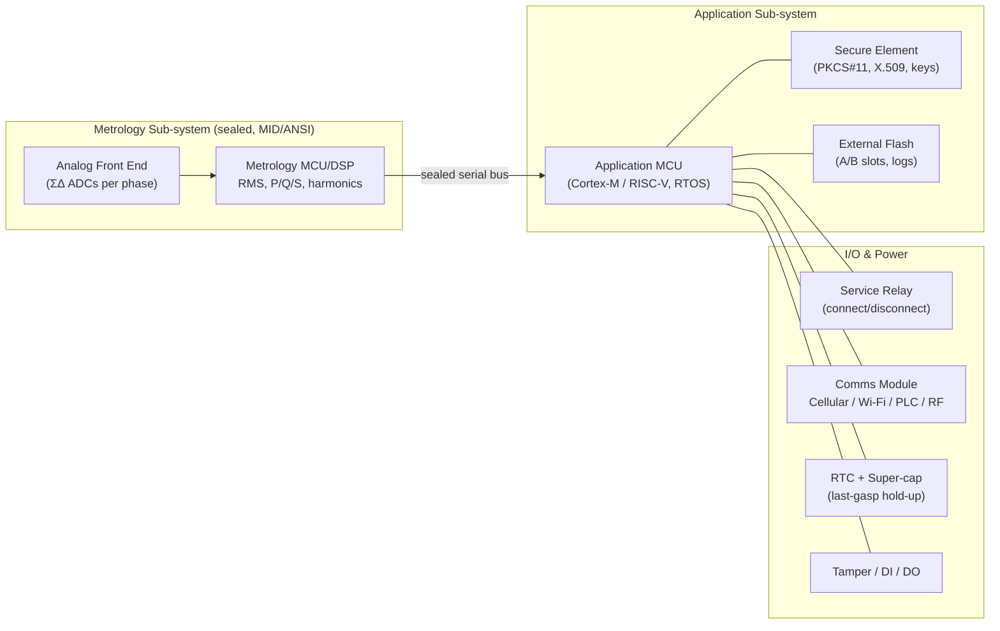
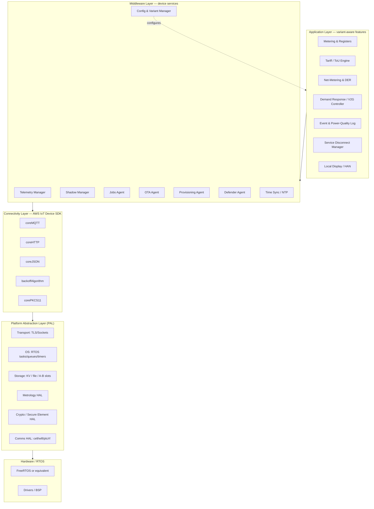
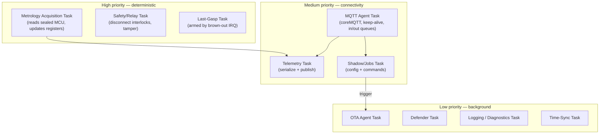
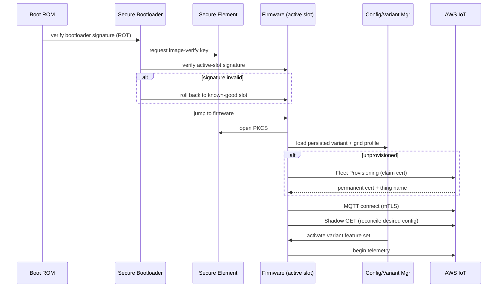

# 02 — Firmware Architecture

The internal design of the meter firmware: hardware context, layered module
architecture, the RTOS task model, boot/secure-boot flow, fault handling, and
memory/storage layout. The design is **single-image, variant-configurable**
(see [03](03-variant-configuration.md)) and built on the AWS IoT Device SDK
libraries in `../libraries/`.

---

## 1. Reference hardware context

A representative dual-MCU metering platform (the firmware is portable across
specific silicon via the `platform/` abstraction in this repo):

The **metrology MCU** is sealed and certified for accuracy; it never touches the
network. The **application MCU** runs this firmware and the SDK, and treats
metrology reads as authenticated, read-only inputs.

---

## 2. Layered module architecture

**Layer contracts**

- **Application** depends only on Middleware interfaces; it is where variant
  behavior lives. It never calls the SDK directly.
- **Middleware** is the home of the *device services* — each maps to one AWS IoT
  capability and owns one SDK context. It is variant-agnostic; the Config &
  Variant Manager (M7) feeds it policy.
- **Connectivity** is the unmodified AWS IoT Device SDK. We add no protocol code
  here — we configure and call it.
- **PAL** is the only layer that knows the silicon. Porting = re-implementing PAL.
  This mirrors the existing `../platform/` directory of this repository.

---

## 3. Module responsibilities

### Application layer

| Module | Responsibility | Variant sensitivity |
|--------|----------------|--------------------|
| Metering & Registers | Maintain billing registers (kWh in/out, kVARh, kVA demand) from metrology reads | # phases, demand register on/off |
| Tariff / ToU Engine | Apply active rate schedule (flat/ToU/RTP/CPP), maintain per-rate registers | rate complexity, # registers |
| Net-Metering & DER | Four-quadrant accounting; separate import/export; PV/battery sub-metering | export accounting depth |
| DR / V2G Controller | Execute curtailment & V2G authorization windows; signal HEMS/EVSE | commercial: building DR; res: appliance DR |
| Event & PQ Log | Sags/swells, THD, frequency, tamper, reverse-energy alarms | PQ depth, harmonic order |
| Service Disconnect | Safe relay open/close with interlocks, remote + local | always present; commercial adds load-limit |
| Local Display / HAN | Optional LCD + Home-Area-Network interface | res: in-home display; comm: BACnet/Modbus |

### Middleware layer (device services)

| Module | SDK library it drives | Doc |
|--------|----------------------|-----|
| Telemetry Manager | `coreMQTT` + `coreJSON` | [05 §2](05-aws-iot-integration.md) |
| Shadow Manager | `device-shadow` | [05 §3](05-aws-iot-integration.md), [08](08-data-model-shadow.md) |
| Jobs Agent | `jobs` | [05 §4](05-aws-iot-integration.md), [07](07-ota-and-lifecycle.md) |
| OTA Agent | `ota` (+ `coreHTTP`, `corePKCS11`) | [07 §3](07-ota-and-lifecycle.md) |
| Provisioning Agent | `fleet-provisioning` | [07 §1](07-ota-and-lifecycle.md) |
| Defender Agent | `device-defender` | [06 §5](06-security-architecture.md) |
| Config & Variant Manager | reads Shadow; persists to PAL storage | [03](03-variant-configuration.md) |
| Time Sync | SNTP via PAL; disciplines RTC | needed for ToU & last-gasp timestamps |

---

## 4. RTOS task model

Tasks are prioritized so that **revenue accuracy and safety** preempt
connectivity, and connectivity preempts background management.

**Concurrency rules**

- A single **MQTT Agent task** owns the `coreMQTT` context; all other tasks
  enqueue publish/subscribe requests to it (thread-safe serialization). This is
  the pattern demonstrated by the `mqtt` demos in `../demos/mqtt/`.
- Metrology and safety tasks never block on the network. They write to
  power-fail-safe storage; the network layer reads asynchronously.
- `backoffAlgorithm` governs every reconnect/retry with jitter to prevent fleet
  thundering-herd after a regional outage.

---

## 5. Boot & secure-boot flow

Secure boot, A/B slots, and rollback are detailed in
[06 §1](06-security-architecture.md) and [07 §3](07-ota-and-lifecycle.md).

---

## 6. Memory & storage layout

| Region | Contents | Properties |
|--------|----------|-----------|
| Internal flash — bootloader | Secure bootloader, root-of-trust public key | immutable / write-locked |
| Internal flash — slot A | Firmware image A | signed, executable |
| Internal flash — slot B | Firmware image B (OTA target) | signed, swap on success |
| Secure element | Device private key, certs, counters | never leaves SE |
| External flash — config | Variant, grid profile, calibration, shadow cache | wear-leveled, CRC, A/B copies |
| External flash — registers | Billing registers, ToU buckets | **power-fail atomic** (journaled) |
| External flash — logs | Event log, PQ log, last-gasp queue | ring buffer, signed records |
| RTC-backed RAM | Time, last-gasp staging, demand window | super-cap retained |

Billing registers and the event log are **append-only and integrity-protected**
(per-record signature/MAC from the secure element) so that a compromised
application image cannot silently rewrite revenue history.

---

## 7. Fault handling & resilience

- **Network loss** → telemetry buffered in the log ring (store-and-forward);
  flushed on reconnect with original timestamps. `backoffAlgorithm` paces retries.
- **Power loss** → brown-out IRQ arms the Last-Gasp task; super-cap holds up long
  enough to publish a final outage message (or hand it to the DCU).
- **Bad config** → Config Manager validates against a schema before activation;
  invalid desired-state is rejected and reported back via the Shadow `reported`
  document, never applied.
- **OTA failure** → A/B slots + watchdog-gated "first-boot health check"; a new
  image that fails to check in within N minutes triggers automatic rollback.
- **Clock loss** → records flagged `time_unsynced`; ToU falls back to last known
  schedule; MDMS estimates per standard rules.

Continue to [03 — Variant Configuration](03-variant-configuration.md).
