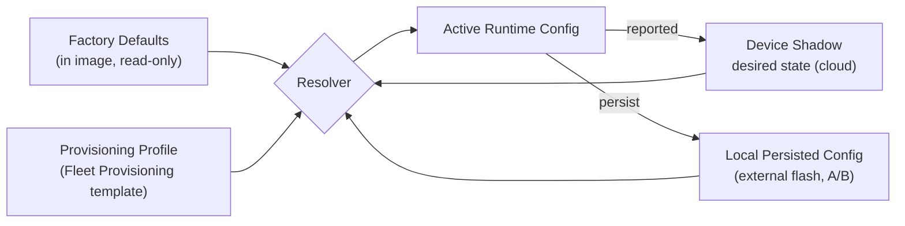
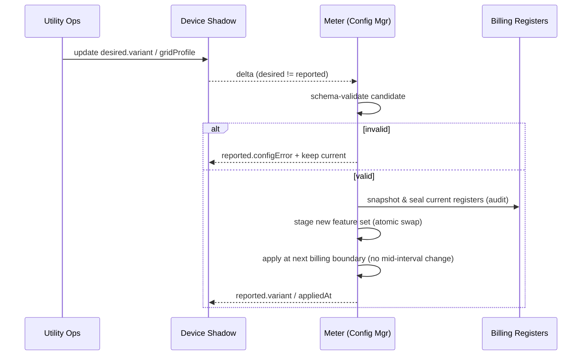

# 03 — Variant Configuration: One Image, Two Meters

This is the heart of the requirement: **a single firmware image that becomes a
Residential meter or a Commercial meter purely through firmware settings.** This
document defines the configuration model, the resolution order, what each variant
turns on, and how the variant is changed safely in the field.

---

## 1. Design principle — data-driven variants

We deliberately **do not** ship two firmware builds. Reasons:

- One signed image → one OTA campaign, one test matrix, one CVE surface.
- Variant is a **runtime policy**, not compile-time, so a meter can be
  re-purposed (e.g. a residential unit moved to a small-commercial service)
  without a re-flash — just a Shadow desired-state change.
- Feature gating is centralized in the **Config & Variant Manager** (M7 in
  [02 §2](02-firmware-architecture.md)), keeping application modules clean.

Compile-time `#define`s are reserved **only** for things that are physically
impossible to change in the field (e.g. region's mains nominal where the AFE is
calibrated for it). Everything else is configuration.

---

## 2. Configuration sources & resolution order



**Precedence (highest wins):**

1. **Device Shadow `desired`** — the cloud is the source of truth for managed
   fleets. A validated desired-state change reconfigures the meter live.
2. **Local persisted config** — last good config, used at boot before the cloud
   is reachable, and as the offline fallback.
3. **Provisioning profile** — set once at onboarding from the Fleet Provisioning
   template (e.g. utility assigns variant + tariff region at install).
4. **Factory defaults** — safe baseline (residential, flat tariff, conservative
   cadence) so an unconfigured meter still meters and reports.

The resolver validates every candidate against the JSON schema in
[`config-examples/`](config-examples/) before activation; invalid input is
rejected and surfaced in the Shadow `reported.configError` field.

---

## 3. The variant contract

The top-level setting:

```json
{
  "variant": "residential",      // "residential" | "commercial"
  "gridProfile": "us-ca-pge",    // regional tariff/grid profile id
  "evReady": true                // enables EV/DER feature group
}
```

`variant` selects a **feature bundle**; `gridProfile` overlays
region-specific tariff, voltage, and regulatory parameters; `evReady` toggles the
EV/DER feature group independently (a residential meter without an EV still works,
one with an EV gets the four-quadrant + V2G features of [04](04-ev-grid-complexity.md)).

---

## 4. What each variant activates

| Capability | Residential | Commercial |
|------------|-------------|------------|
| **Metrology phases** | Single-phase / split-phase (2–3 wire) | Polyphase (3-phase, 4-wire) |
| **CT/PT ratios** | Direct-connect (whole-current) | Instrument-transformer ratios configurable |
| **Energy registers** | kWh import/export | kWh, kVARh, kVAh import/export per phase |
| **Demand register** | Optional (peak kW) | **Yes** — sliding/block demand, kVA, power factor |
| **Tariff engine** | Flat / ToU / simple RTP | Full ToU + CPP + demand charges + ratchets |
| **Reporting cadence (default)** | 15-min interval | 1–5-min interval + on-demand reads |
| **Power-quality logging** | Sags/swells, outages | + harmonics (THD to configurable order), flicker |
| **Service disconnect** | Single relay | Relay + **load-limit / curtailment** mode |
| **Demand response** | Appliance-level (water heater, HVAC, EVSE) | Building-level (BEMS/BACnet), capacity DR |
| **V2G authorization** | If `evReady` | If `evReady` (fleet depots) |
| **HAN / display** | In-home display, Zigbee/Wi-SUN HAN | BACnet/Modbus to BEMS |
| **Telemetry schema** | `res.v1` profile | `comm.v1` profile (richer per-phase) |

> The activation table is implemented as a **feature-flag matrix** keyed on
> `variant` + `evReady` + `gridProfile`. Application modules query the Config
> Manager (`cfg_feature_enabled(FEATURE_DEMAND_REGISTER)`), never `#ifdef`.

---

## 5. Example resolved configs

**Residential with EV (split-phase, ToU, four-quadrant for solar+EV):**
See [`config-examples/residential-ev.json`](config-examples/residential-ev.json).

**Commercial (3-phase, demand charges, building DR):**
See [`config-examples/commercial.json`](config-examples/commercial.json).

Both validate against
[`config-examples/meter-config.schema.json`](config-examples/meter-config.schema.json).

---

## 6. Changing variant/config in the field — safely



**Safety rules for live reconfiguration**

- **Never** change registers/tariff mid-interval; apply at the next interval or
  billing boundary so no energy is double-counted or lost.
- A variant change **seals and snapshots** the outgoing register set into the
  audit log (signed) before switching schema — preserves billing continuity.
- Metrology-affecting changes (phases, CT ratio) require a **calibration-lock
  check**; if the hardware can't support the requested phases, the change is
  rejected, not forced.
- Every applied change is echoed in `reported` with an `appliedAt` timestamp so
  the head-end has an authoritative audit trail.

---

## 7. Why runtime variants matter for the EV-era grid

Grid operators are re-classifying customers as EVs and DERs spread:
a home that installs a V2G charger may move to a commercial-style ToU+export
tariff. Runtime variant + `gridProfile` lets the utility **re-tariff and
re-feature a meter over the air** during a single OTA-managed fleet, instead of
truck-rolling a replacement. This is the operational pay-off of the single-image
design.

Continue to [04 — EV & Grid Complexity](04-ev-grid-complexity.md).
