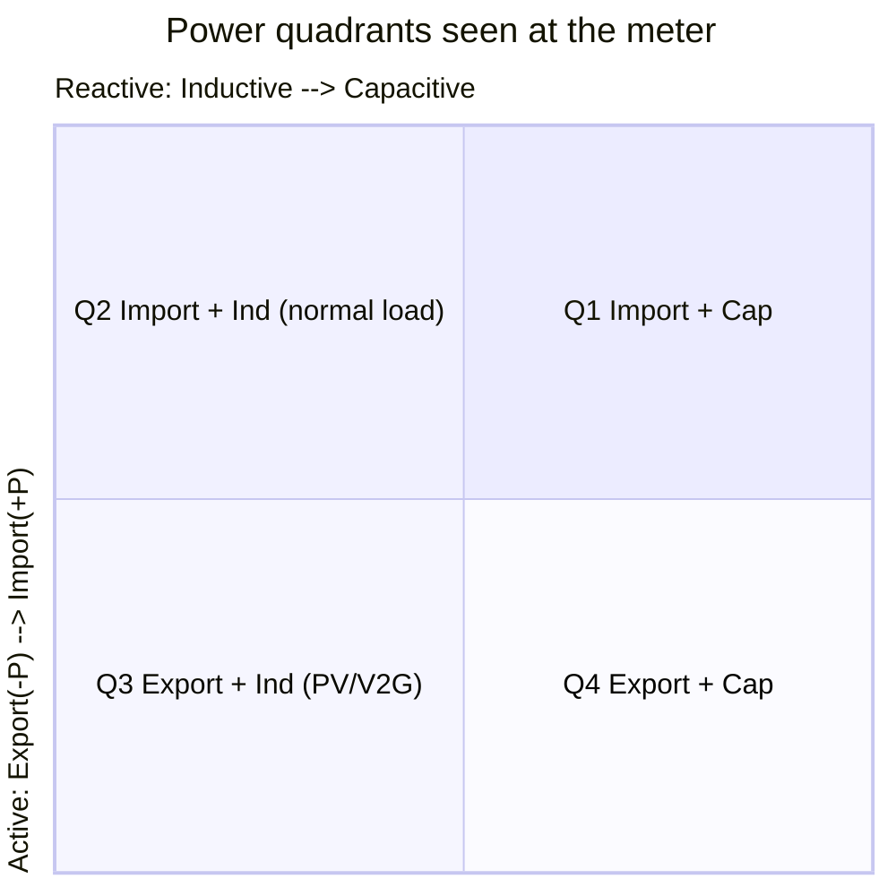
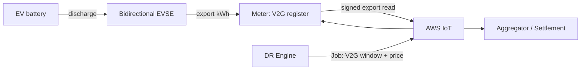
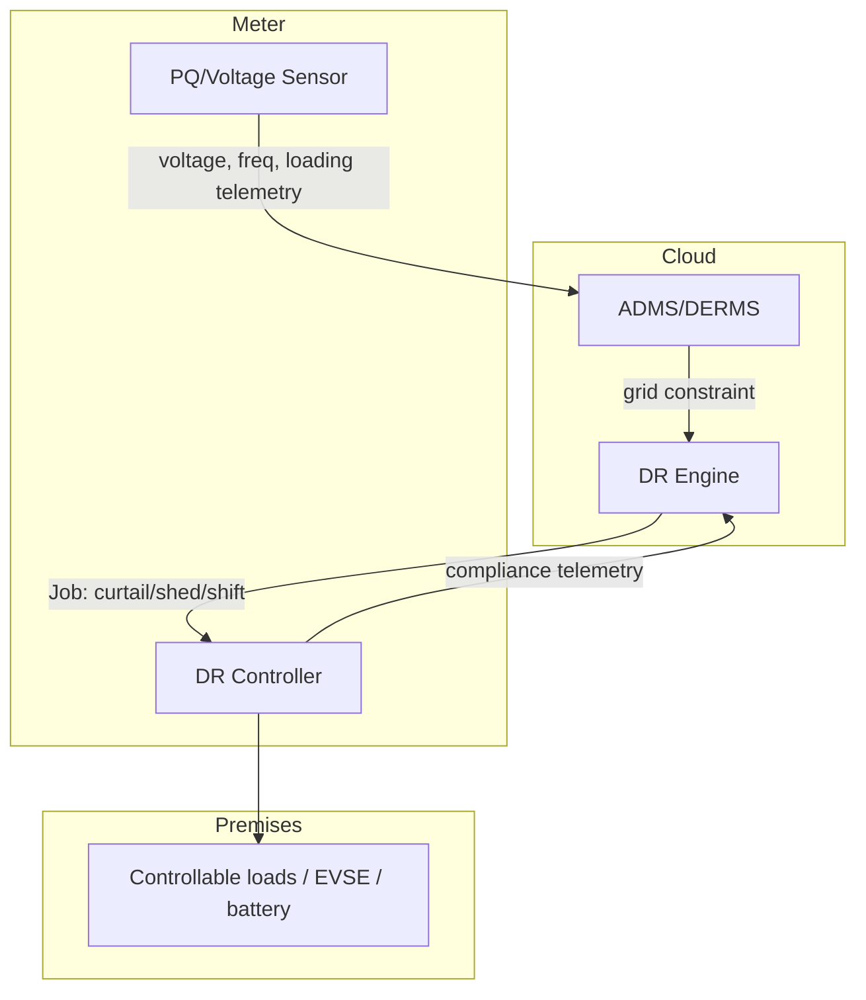

# 04 — EV & Grid Complexity

How the firmware handles the *new* grid: bidirectional power flow, EV fast
charging, V2G/V2H, distributed energy resources (DER), dynamic tariffs, and
demand response. These are the capabilities that distinguish this design from a
legacy one-way meter, and they apply (in scaled form) to **both** variants.

---

## 1. The problem EVs create

| Legacy assumption | EV-era reality | Firmware consequence |
|-------------------|----------------|----------------------|
| Power flows one way (grid → load) | Bidirectional (V2G, PV export) | Four-quadrant metrology & accounting |
| Loads are small & smooth | EV L2/DC charging is large & spiky (7–19 kW+) | High-rate sampling, demand tracking, fast PQ events |
| Demand is uncontrollable | EV/HEMS loads are controllable | Meter as DR/curtailment control point |
| Flat or simple ToU tariffs | RTP, CPP, export credits, demand charges | Rich tariff engine + day-ahead schedules |
| Transformer sized for diversity | Clustered EVs defeat diversity | Voltage/loading telemetry for transformer protection |

---

## 2. Four-quadrant metrology & net accounting

With PV export *and* V2G discharge, a premises is a **prosumer**. The meter must
separately account for all four power quadrants instead of a single net register.



Registers maintained (per phase on commercial):

- `kWh_import`, `kWh_export` (active energy both directions)
- `kVARh` per quadrant (reactive)
- `kVAh` (apparent), `peak_kW` / `peak_kVA` demand
- `net_kWh = import − export` for net-metering settlement

This is why **`evReady` forces four-quadrant accounting even on residential**
([03 §3](03-variant-configuration.md)): a single rooftop-solar + EV home already
needs it.

---

## 3. EV charging visibility & coordination

The meter does not control the EVSE directly (that's the EVSE/HEMS job), but it
**observes, authorizes windows, and signals** so the grid stays within limits.

```mermaid
sequenceDiagram
    participant DRE as DR Engine (cloud)
    participant M as Meter (DR/V2G Ctrl)
    participant HEMS as HEMS/EVSE
    participant XFMR as Transformer (shared)

    DRE->>M: IoT Job: "limit import to 7kW, 16:00-20:00"
    M->>M: validate against safety & tariff
    M->>HEMS: signal setpoint (local API / OCPP smart-charging)
    HEMS->>HEMS: throttle EV charge current
    M->>M: meter actual; enforce via load-limit if breached
    M->>DRE: telemetry: setpoint, actual, compliance
    Note over XFMR: aggregate import stays under transformer rating
```

- **Authorization windows**: the meter holds the currently-authorized
  import/export envelope (from Jobs/Shadow) and signals the HEMS/EVSE setpoint.
- **Enforcement fallback**: if the EVSE ignores the signal and the envelope is
  breached, the meter's **load-limit mode** (commercial) or appliance-relay
  (residential) acts as a backstop.
- **Smart charging interop**: setpoints map to OCPP 2.0.1 smart-charging
  profiles / ISO 15118-2 at the EVSE; the meter speaks the *grid* side and the
  HEMS translates to the *charger* side.

---

## 4. V2G / V2H

When the EV exports power back to the grid (V2G) or the home (V2H):

- The meter accounts EV export distinctly from PV export (sub-metered CT or HEMS
  attribution) so **V2G can be credited/settled** differently from solar.
- A **V2G authorization window** (granted via Jobs from the DR engine /
  aggregator) defines when, how much, and at what price the EV may export.
- Anti-islanding and safety remain the inverter/EVSE's responsibility; the meter
  records and attests the energy and enforces the time/quantity envelope.



---

## 5. Dynamic tariffs (ToU / RTP / CPP)

The Tariff Engine ([02 §3](02-firmware-architecture.md)) consumes day-ahead and
real-time price schedules and bins energy into the correct register.

| Tariff | How it arrives | Meter behavior |
|--------|----------------|----------------|
| **ToU** | Shadow `gridProfile` schedule | Switch active rate register by time-of-day/season |
| **RTP** | Day-ahead schedule via Jobs/Shadow | Per-interval price tag attached to each read |
| **CPP** | Real-time Job (event day) | Activate critical-peak register + customer signal |
| **Export credit** | Profile + RTP | Credit `kWh_export` at applicable price |
| **Demand charge** (comm) | Profile | Track ratcheted peak kW/kVA per period |

All price-tagged interval data is published with the tariff context so MDMS/
billing can settle without re-deriving the schedule.

---

## 6. Demand response & grid services

The meter is a **DR endpoint** and a **grid-edge sensor** feeding ADMS/DERMS.



**DR program types supported**

- **Direct load control** — relay/appliance shed (residential) or building
  curtailment (commercial), executed via Jobs with a verifiable compliance report.
- **Capacity / economic DR** — shift consumption out of priced peaks via the
  tariff schedule; the meter measures the achieved shift.
- **Frequency/voltage support** — the meter is primarily a *sensor* here; fast
  control stays in the inverter/EVSE, but the meter's high-rate voltage/frequency
  telemetry is the verification and triggering data source for ADMS.

---

## 7. Grid-edge sensing for transformer & feeder health

Clustered EV charging can overload a distribution transformer that was sized
assuming load diversity. The meter contributes the data that prevents this:

- **Voltage / per-phase loading** telemetry → correlated at L2/L4 to detect a
  transformer approaching its rating.
- **Reverse-power & over-voltage events** from heavy PV/V2G export → flags
  feeders where export exceeds hosting capacity.
- **Outage (last-gasp) & restoration (first-breath)** → faster, finer outage maps
  than legacy SCADA, including which phase/segment.

These feed the ADMS/DERMS at L4 ([01 §2](01-grid-system-architecture.md)) and
close the loop back into DR setpoints (§6).

---

## 8. Putting it together — an EV-evening scenario

1. 16:00 — DR engine sees a forecast feeder peak; issues a Job: *residential
   group, limit EV import to 6 kW, 16:00–20:00, RTP premium in effect*.
2. The meter validates the Job, signals the EVSE setpoint via the HEMS, and tags
   incoming energy at the RTP premium.
3. 18:30 — local voltage sags from neighborhood load; the meter's PQ telemetry
   flags it to ADMS, which tightens the DR setpoint to 4 kW; new Job propagates.
4. 21:00 — RTP drops below the V2G threshold; a V2G window opens; the EV exports;
   the meter credits `kWh_export` at the V2G price and attests the energy.
5. 23:00 — window closes; the meter publishes the interval summary; MDMS settles
   import, export, and V2G credit separately.

Every step uses the SDK mechanisms mapped in
[05 — AWS IoT Integration](05-aws-iot-integration.md).
