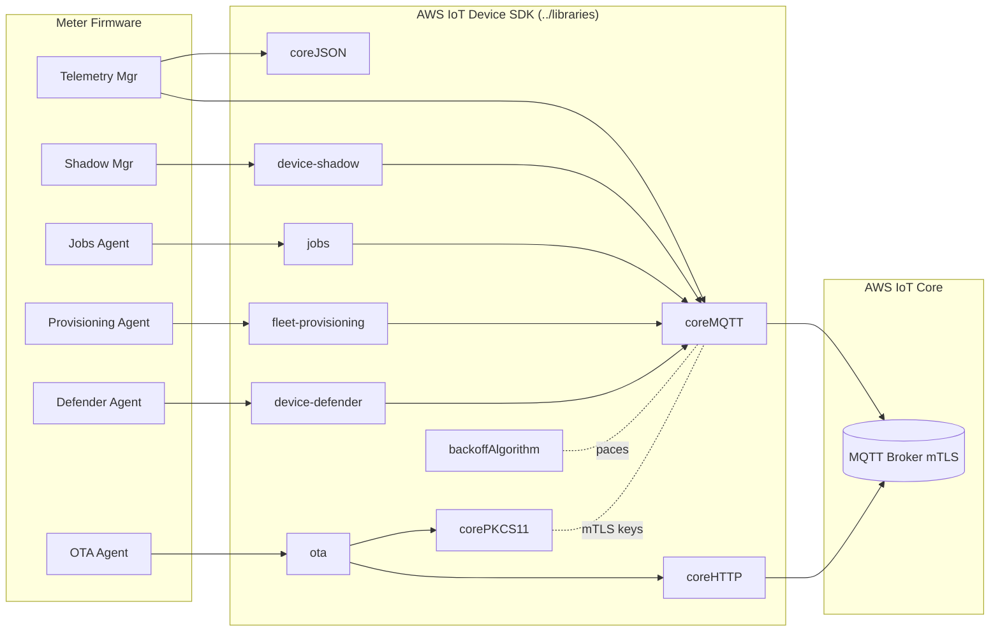

# 05 — AWS IoT Integration Mapping

Every cloud-facing firmware responsibility maps to a concrete library already
vendored in `../libraries/`. This document is the bridge between the middleware
"device services" of [02](02-firmware-architecture.md) and the SDK.

---

## 1. Library map

| SDK library (`../libraries/...`) | Firmware use | Meter responsibility |
|----------------------------------|--------------|----------------------|
| `standard/coreMQTT` | MQTT 3.1.1 client | Transport for all telemetry, shadow, jobs, defender |
| `standard/coreHTTP` | HTTP client | OTA file download, large pre-signed-S3 fetches |
| `standard/coreJSON` | JSON parser | Parse shadow deltas, job docs, config; build payloads |
| `standard/corePKCS11` | PKCS#11 crypto | Device key/cert storage, TLS client auth, OTA verify |
| `standard/backoffAlgorithm` | Retry with jitter | Reconnect/retry pacing, fleet thundering-herd control |
| `aws/device-shadow` | Device Shadow client | Variant/config contract, reported state |
| `aws/jobs` | Jobs client | DR commands, V2G windows, remote ops, OTA orchestration |
| `aws/ota` | OTA agent | Firmware updates (A/B, signed) |
| `aws/fleet-provisioning` | Fleet Provisioning | First-boot onboarding & identity |
| `aws/device-defender` | Defender client | Security/health metrics, anomaly detection |
| `aws/sigv4` | SigV4 signer | Sign direct AWS API/S3 requests when not using IoT creds |

These are exactly the directories enumerated in
[`../libraries/standard`](../libraries/standard) and
[`../libraries/aws`](../libraries/aws).

---

## 2. Telemetry — `coreMQTT` + `coreJSON`

- A **single MQTT Agent task** owns the `coreMQTT` context (see
  [02 §4](02-firmware-architecture.md)); other tasks enqueue publishes. This is
  the thread-safe pattern shown in `../demos/mqtt/`.
- Interval reads, PQ events, and last-gasp messages are serialized with
  `coreJSON` (or CBOR for bandwidth-constrained PLC links) and published to
  per-purpose topics ([08 §2](08-data-model-shadow.md)).
- QoS: interval reads QoS1 (billing-critical, store-and-forward); high-frequency
  PQ streaming QoS0 where loss is tolerable; commands/jobs QoS1.

```c
/* Illustrative — telemetry publish via the MQTT agent queue */
MeterIntervalRead_t read;
metrology_get_interval( &read );                 /* sealed metrology HAL  */
size_t len = telemetry_serialize_json( buf, sizeof(buf), &read );
mqtt_agent_publish( topic_interval, buf, len, MQTTQoS1 ); /* enqueue, non-blocking */
```

---

## 3. Configuration — `device-shadow`

The Device Shadow is the **variant & configuration contract**
([03](03-variant-configuration.md), [08 §3](08-data-model-shadow.md)):

- `desired` ← utility sets variant, gridProfile, cadence, DR enrollment.
- `reported` ← meter echoes applied config, firmware version, health, appliedAt.
- The Shadow Manager subscribes to `/update/delta`, validates, applies at a safe
  boundary, and reports back. Uses the `device-shadow` API over the shared MQTT
  agent.

---

## 4. Commands & grid services — `jobs`

IoT Jobs carry **discrete, auditable operations** with lifecycle and reporting:

| Job type | Payload | Handler |
|----------|---------|---------|
| `dr.curtail` | setpoint, window, program id | DR/V2G Controller ([04 §3](04-ev-grid-complexity.md)) |
| `v2g.window` | export limit, price, window | DR/V2G Controller |
| `tariff.update` | day-ahead RTP/CPP schedule | Tariff Engine |
| `service.disconnect` / `connect` | reason, interlocks | Service Disconnect Mgr |
| `meter.read` | on-demand register snapshot | Metering & Registers |
| `ota` | OTA stream descriptor | OTA Agent (§5) |

Jobs are preferred over raw MQTT for these because they are **idempotent,
acknowledged, and individually status-tracked** — essential for a remote
disconnect or a DR compliance audit.

---

## 5. Firmware updates — `ota` (+ `coreHTTP`, `corePKCS11`)

- OTA campaigns are orchestrated by the OTA service and delivered over MQTT or
  HTTP (`coreHTTP` for S3 pre-signed downloads).
- Image signature is verified with `corePKCS11` against the root-of-trust key
  before activation — see [07 §3](07-ota-and-lifecycle.md).
- A/B slot swap + self-test gate + automatic rollback on failed health check.

---

## 6. Onboarding — `fleet-provisioning`

First boot uses a **claim certificate** to call the Fleet Provisioning template,
which returns a unique per-device certificate and thing name, and stamps the
provisioning profile (variant/gridProfile) — see [07 §1](07-ota-and-lifecycle.md).
Mirrors `../demos/fleet_provisioning/`.

---

## 7. Security & health — `device-defender`

The Defender Agent publishes device-side metrics (open ports, connection counts,
bytes in/out, listening services) on the reserved Defender topics. Deviations
(e.g. unexpected outbound connection, telemetry flooding) raise cloud-side alarms.
Mirrors `../demos/defender/`. See [06 §5](06-security-architecture.md).

---

## 8. End-to-end mapping diagram



Continue to [06 — Security Architecture](06-security-architecture.md).
