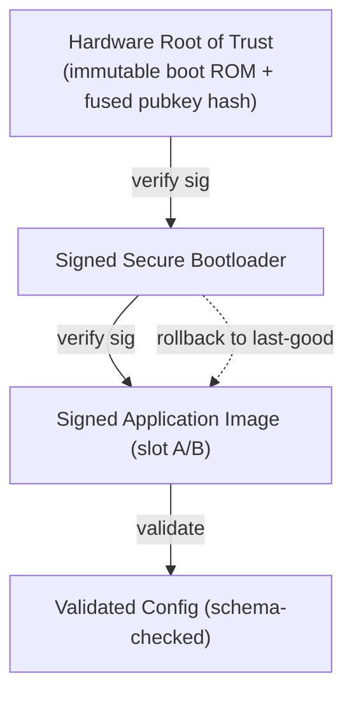

# 06 — Security Architecture

A revenue meter is a regulated, tamper-relevant, billing-critical device that can
also **disconnect service** and **shape grid load**. Its security model must
protect billing integrity, device identity, the disconnect actuator, and the
grid-control path. This document covers identity, secure boot, transport, the
Defender baseline, and key lifecycle.

---

## 1. Threat model (summary)

| Asset | Threat | Mitigation |
|-------|--------|------------|
| Billing registers | Tampering to under-report | Sealed metrology MCU + signed append-only registers ([02 §6](02-firmware-architecture.md)) |
| Device identity | Cloning / impersonation | Per-device X.509 key in secure element, never exported |
| Firmware | Malicious image / rollback | Secure boot, signed OTA, A/B + anti-rollback ([07](07-ota-and-lifecycle.md)) |
| Disconnect relay | Unauthorized mass disconnect | Jobs (authN/Z + audit), local interlocks, rate-limit |
| Grid-control path (DR/V2G) | Forged setpoints destabilizing feeder | Signed Jobs, envelope validation, safety clamps |
| Telemetry | Eavesdrop / forge reads | mTLS + payload signing for revenue reads |
| Comms | Flooding / DoS / lateral move | Defender baseline, backoff, least-privilege policy |

---

## 2. Secure boot & chain of trust



- The root-of-trust public-key hash is **fused** into the SoC; the boot ROM
  verifies the bootloader, which verifies the application image
  ([02 §5](02-firmware-architecture.md)).
- **Anti-rollback** counters prevent downgrading to a vulnerable image.
- Verification uses keys held in the **secure element** via `corePKCS11`.

---

## 3. Device identity & provisioning

- Each meter holds a **unique X.509 certificate + private key** generated in /
  bound to the **secure element**; the private key never leaves it.
- Birth/claim credentials are used only once at onboarding via
  **Fleet Provisioning** ([07 §1](07-ota-and-lifecycle.md)), then replaced by the
  per-device operational certificate.
- TLS client authentication (mTLS) uses the PKCS#11 token so the key is used,
  never read — `corePKCS11` provides the crypto operations to `coreMQTT`'s TLS
  transport.

---

## 4. Transport security

- **TLS 1.2+ mutual auth** on every cloud connection; server cert pinned to the
  AWS IoT trust anchors.
- **Least-privilege IoT policy**: the meter's certificate is authorized only for
  its own thing-scoped topics (telemetry, its shadow, its jobs, defender) — no
  wildcard publish. A compromised meter cannot read or command its neighbors.
- **Per-record revenue signing**: interval reads carry a secure-element signature
  in addition to TLS, so billing integrity survives even a TLS-terminating proxy
  (e.g. at a DCU) — the cloud verifies the meter, not the concentrator.

---

## 5. Runtime security monitoring — Device Defender

The Defender Agent ([05 §7](05-aws-iot-integration.md)) publishes a behavioral
baseline so the cloud can alarm on deviation:

| Metric | Why it matters for a meter |
|--------|----------------------------|
| Outbound connection count / destinations | Detect C2 / lateral movement |
| Bytes in/out, message rate | Detect telemetry flooding or exfiltration |
| Listening TCP/UDP ports | Detect an opened backdoor service |
| Auth failures | Detect credential brute force |

Combined with **custom metrics** (e.g. unexpected relay operations, config-error
rate, time-unsynced ratio) this gives the SOC fleet-wide anomaly detection.

---

## 6. Protecting the control path (DR / V2G / disconnect)

The new grid functions make the meter an **actuator**, which raises the stakes:

- **Disconnect & curtailment commands arrive only as Jobs** — authenticated,
  authorized, individually audited, and acknowledged.
- The firmware enforces **local safety envelopes**: a Job can't open the relay
  while a safety interlock is asserted, can't exceed configured load-limit bounds,
  and can't issue a V2G export outside the calibrated/regulated envelope.
- **Rate limiting & staggering** on mass operations prevents a single compromised
  command from disconnecting or curtailing an entire feeder simultaneously.
- All actuator events are written to the **signed, append-only audit log**
  ([02 §6](02-firmware-architecture.md)).

---

## 7. Key & credential lifecycle

```mermaid
sequenceDiagram
    participant FAC as Factory
    participant SE as Secure Element
    participant FP as Fleet Provisioning
    participant IOT as AWS IoT
    participant OPS as Utility PKI

    FAC->>SE: inject claim cert + generate device keypair (in-SE)
    SE->>FP: present claim cert at first boot
    FP->>IOT: register thing, issue operational cert
    IOT-->>SE: store operational cert (key stays in SE)
    Note over SE,IOT: periodic rotation via Jobs + Fleet Prov.
    OPS->>IOT: revoke on decommission/compromise
    IOT-->>SE: cert revoked; meter quarantined
```

- **Rotation**: operational certs rotate on a schedule via a provisioning Job;
  the in-SE keypair can be regenerated without exposing key material.
- **Revocation**: a lost/compromised/decommissioned meter's cert is revoked
  cloud-side; the device is denied connection and quarantined
  ([07 §4](07-ota-and-lifecycle.md)).
- **Crypto-agility**: `corePKCS11` abstracts the algorithm, allowing migration to
  stronger curves / post-quantum primitives via OTA + SE update.

Continue to [07 — OTA & Device Lifecycle](07-ota-and-lifecycle.md).
