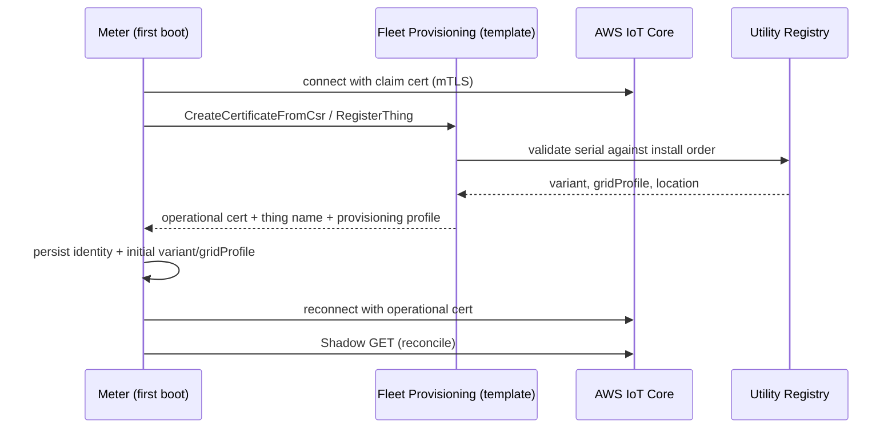
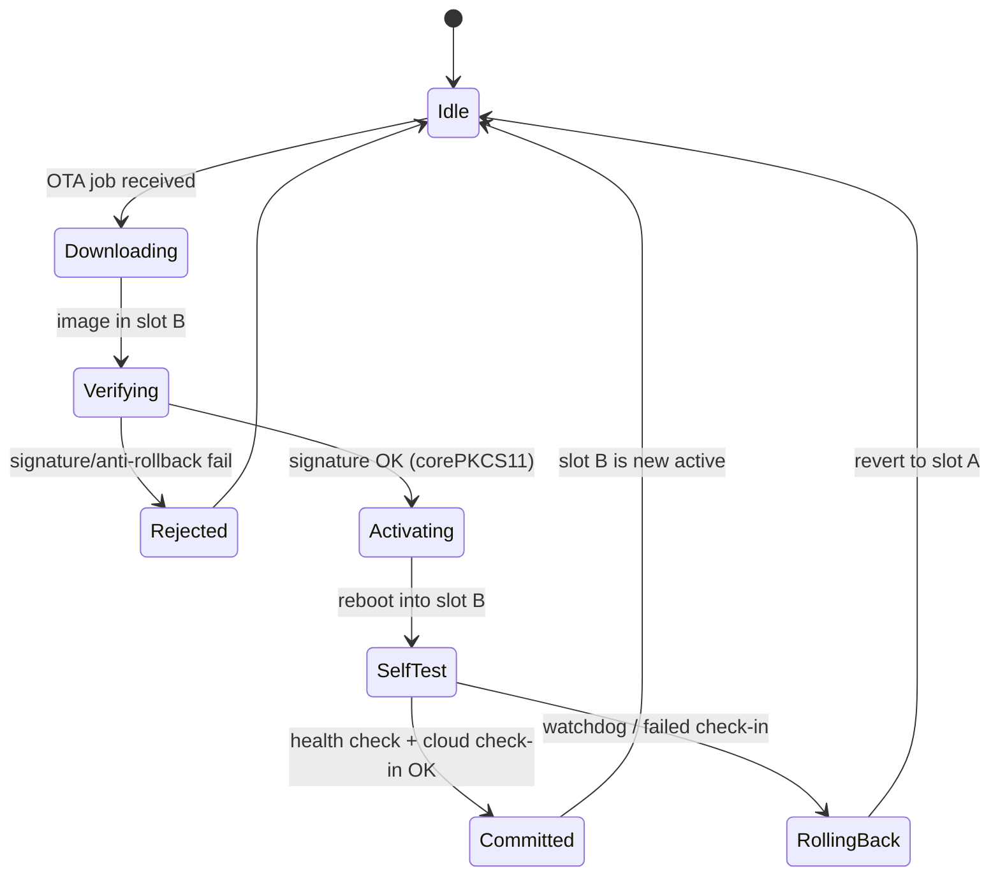
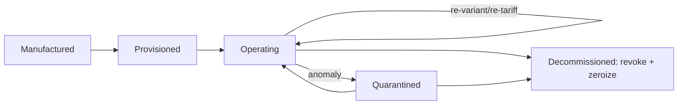

# 07 — OTA & Device Lifecycle

The full lifecycle of a meter as a managed fleet member: manufacture →
provisioning → operation → firmware updates → re-tariff/re-variant →
decommissioning. Built on Fleet Provisioning, Jobs, and OTA from the SDK.

---

## 1. Provisioning (onboarding)

- Uses `aws/fleet-provisioning` (see `../demos/fleet_provisioning/`).
- The template stamps **variant/gridProfile** at install, seeding the
  configuration resolver ([03 §2](03-variant-configuration.md)).
- Claim credentials are single-purpose and replaced immediately
  ([06 §3](06-security-architecture.md)).

---

## 2. Fleet rollout strategy

Meters number in the millions; rollouts must be controlled:

- **Thing groups** by variant, gridProfile, hardware rev, and firmware version
  drive targeted Shadow/Jobs/OTA campaigns.
- **Canary → staged → fleet** rollout: 1% canary, then expanding rings, each
  gated on Defender health + OTA success metrics.
- **`backoffAlgorithm` everywhere** so a regional reconnect (post-outage) or a
  campaign doesn't thundering-herd the broker.

---

## 3. OTA firmware update (A/B, signed, rollback-safe)

- Download over MQTT or HTTP (`coreHTTP` for S3); see `../demos/ota/`.
- **Signature verified with `corePKCS11`** against the root of trust before
  activation ([06 §2](06-security-architecture.md)); anti-rollback enforced.
- **Self-test gate**: the new image must pass a metrology sanity check *and*
  successfully check in to the cloud within a watchdog window, or the bootloader
  auto-reverts to the last-good slot.
- **Metrology firmware** (the sealed MCU) updates, where allowed by regulation,
  follow a stricter signed path and may require a re-seal/re-cal flag.

---

## 4. In-life management & decommissioning

| Lifecycle event | Mechanism |
|-----------------|-----------|
| Re-tariff / re-variant | Shadow desired change, safe boundary apply ([03 §6](03-variant-configuration.md)) |
| DR enrollment change | Shadow + Jobs |
| Remote disconnect/connect | Jobs with interlocks & audit ([06 §6](06-security-architecture.md)) |
| Cert rotation | Provisioning Job |
| Anomaly response | Defender alarm → Job (quarantine / collect diagnostics / disconnect) |
| Decommission | Revoke cert, final register seal, zeroize SE-held secrets, mark retired in registry |

**Decommissioning** must: seal & upload final billing registers (audit), revoke
the operational certificate cloud-side, zeroize secure-element secrets so the
unit can't be resurrected with its old identity, and mark the thing retired.

Continue to [08 — Data Model & Device Shadow](08-data-model-shadow.md).
