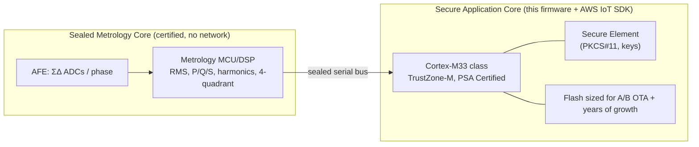
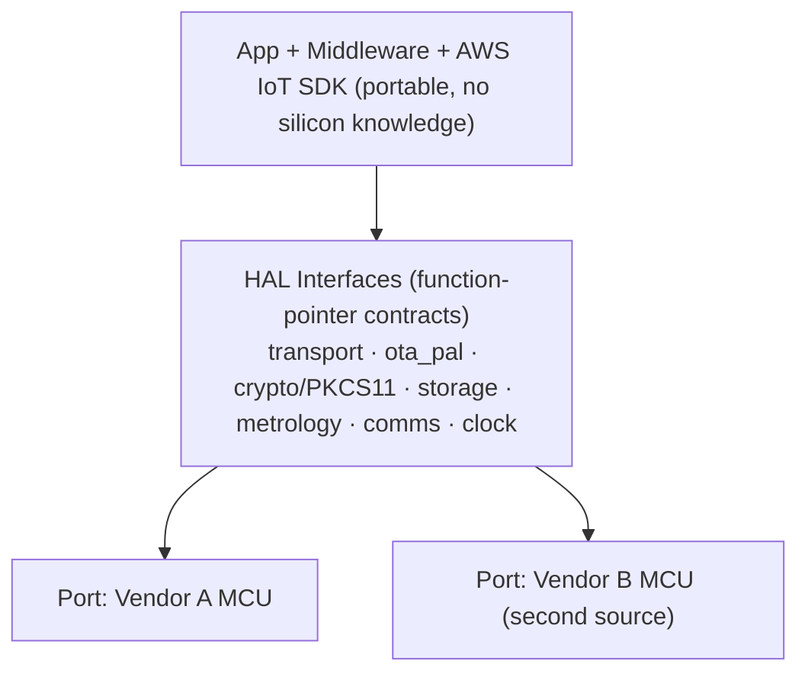
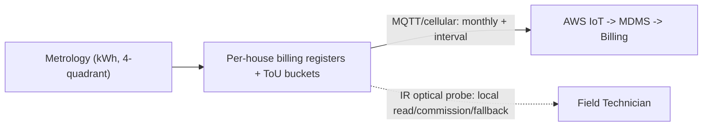

# 09 — Hardware Platform, HAL Reference & Local Interfaces

This document captures the **silicon and abstraction choices** behind the
firmware: which MCU class scales for the future grid, how to structure the
Hardware Abstraction Layer (HAL) using references that already exist in this
repository, and how local interfaces (infrared/optical port) and the monthly
per-house billing channel fit together.

> **Planning assumption — EVs are about to be everywhere.**
> This design assumes **high-to-near-universal EV penetration worldwide within
> 2–3 years** of deployment. A meter installed now must still be adequate when
> *most* of the homes/buildings behind it charge an EV — often more than one —
> with rooftop PV and a battery alongside. That assumption drives every choice
> below toward **headroom, long-life manageability, and second-sourcing**, not
> toward the cheapest part that merely meets today's load.

---

## 1. What "EVs everywhere in 2–3 years" does to the hardware budget

| Pressure from mass EV adoption | Hardware consequence |
|--------------------------------|----------------------|
| 4–6× peak demand, bidirectional, spiky | Faster metrology sampling + four-quadrant accounting on **every** meter, residential included |
| Finer, more frequent telemetry to keep feeders safe | More CPU/RAM headroom and bandwidth than a legacy meter needs |
| Meter becomes a **control point** (DR/V2G) | Deterministic real-time core + safe actuator path, isolated from comms |
| 10–15 year field life through a fast-moving decade | Generous flash for **A/B OTA** for years of feature growth; crypto-agility |
| Millions of new managed nodes, hostile threat surface | Hardware root of trust + secure element are **mandatory, not optional** |
| Volatile semiconductor supply at that volume | Design to an **abstract MCU class** so parts are second-sourceable |

The takeaway: **specify generously and abstract aggressively.** A meter sized for
"today's" residential load will be obsolete before its depreciation period ends.

---

## 2. MCU strategy — pick an architecture class, not a single part

There is no single "the" metering MCU. For future-grid scalability the **dual-core
split** matters more than the vendor (this is the platform assumed in
[02 §1](02-firmware-architecture.md)):

**Application-core selection criteria (in priority order):**

1. **Cortex-M33 (TrustZone-M) + PSA Certified** — security and isolation headroom.
2. **On-die hardware crypto + secure-element path** — for mTLS, signed OTA, signed
   revenue records, and **crypto-agility** (room to migrate to stronger / PQC
   primitives over a long field life).
3. **Flash for A/B OTA with multi-year growth margin** — EV-era features will keep
   arriving; budget slots, don't fill them at launch.
4. **Real-time determinism isolated from comms** — the DR/V2G actuator path must
   not be starved by network work.
5. **Second-sourceable** — at least two vendors can satisfy the abstraction.

> **Selected application MCU (Revision B): GigaDevice GD32W515.** This design
> now instantiates the secure-application-core class with a concrete part — the
> GD32W515 (Cortex-M33, TrustZone, integrated Wi-Fi, hardware crypto, secure
> boot) on the GD32W51x SDK. See
> [12 — GD32W515 Platform](12-gigadevice-gd32w515-platform.md). It sits behind
> the same HAL, so the candidates below remain valid second sources.

**Families that satisfy the class** (validate live availability/lifecycle before a
BOM commit — these are market facts as of early 2026, not a vendor endorsement):

| Role | Candidates | Notes |
|------|-----------|-------|
| Secure application MCU | **GigaDevice GD32W515** (selected, [doc 12](12-gigadevice-gd32w515-platform.md)), ST **STM32U5/STM32H5**, NXP **LPC55Sxx / Kinetis-M (KM3x)**, Renesas **RA6**, Microchip **PIC32CM / SAM L11** | Cortex-M33, TrustZone, PSA Certified |
| Metrology AFE/SoC | Analog Devices **ADE9000/ADE7xxx**, TI **MSP430F67xx**, Renesas **RX23E**, ST **STPMxx** | Certified accuracy, polyphase, four-quadrant |
| Single-chip metering SoC (cost-sensitive residential) | TI **MSP430 metering**, NXP **Kinetis-M**, ADI/Maxim **78M6xxx (Teridian)** | Integrate metrology + app |
| Concentrator / DCU (mesh topology, [01 §3](01-grid-system-architecture.md)) | NXP **i.MX**, TI **Sitara** (Cortex-A, Linux + Greengrass) | Local DR/aggregation, store-and-forward |
| Field-area comms | Silicon Labs **EFR32**, TI **CC13xx** | Sub-GHz / Wi-SUN mesh |

**Recommendation:** Cortex-M33 PSA-Certified application MCU (e.g. STM32U5 /
Kinetis-M / Renesas RA6) + certified metrology AFE (e.g. ADI ADE9000 or TI MSP430
metering). Treat the *Cortex-M33 + PSA + secure-element* contract — not the part
number — as the spec, so a supply shock never forces a firmware rewrite.

---

## 3. HAL architecture — references that already live in this repo

The principle: **a narrow portable interface (function-pointer contract) above a
per-platform port.** Porting to the metering MCU = re-implementing the ports,
never touching the layers above (the PAL boundary in
[02 §2](02-firmware-architecture.md)).

**In-tree references (real, tested, copy the pattern):**

| Reference in this repo | What it teaches |
|------------------------|-----------------|
| [`../platform/posix/transport/`](../platform/posix/transport) | A concrete **port** of the SDK's `TransportInterface_t` (TLS/sockets). Your meter re-implements this for its comms HAL. |
| [`../platform/posix/ota_pal/`](../platform/posix/ota_pal) | The **OTA Platform Abstraction Layer** port — image write/verify/activate. Re-implement for A/B flash + secure-element verify. |
| [`../platform/include/clock.h`](../platform/include/clock.h) | The OS-clock abstraction contract. |
| `../platform/posix/.../utest/mocks/` | How to **unit-test an interface against a mock port** — the gold standard for a portable HAL. |

**External references, best-to-good:**

1. **Zephyr RTOS device driver model** — best open example of a cleanly layered
   HAL (`struct ..._driver_api` per subsystem). Template for naming/granularity.
2. **ARM CMSIS-Driver** — standardized USART/SPI/I2C/Flash interfaces; the
   industry peripheral-HAL contract.
3. **ARM PSA / Trusted Firmware-M (TF-M)** — the **security HAL** (PSA Crypto,
   secure storage), mapping to your `corePKCS11` + secure element
   ([06 §3](06-security-architecture.md)).
4. **DLMS/COSEM (IEC 62056)** — the application/data-model HAL toward the head-end.

**Rules for a HAL that survives the EV decade:**

- Interfaces are pure C function-pointer structs (mirror `TransportInterface_t`).
- **Zero platform `#ifdef`s above the port line** — all silicon knowledge lives
  in the port.
- Every interface ships with a mock-backed unit test (see this repo's `utest/`).
- The port set is the **second-source seam**: swapping MCU vendor changes only the
  ports, satisfying §2's resilience goal.

---

## 4. Local interfaces — infrared/optical port & the billing channel

These are **complementary channels**, exposed through the comms HAL of §3.

### Infrared / optical port — yes, and it stays relevant
- Standardized as the **optical probe under IEC 62056-21** (formerly IEC 61107)
  and **ANSI C12.18** — a galvanically-isolated, short-range **infrared** port on
  the meter face.
- Used by a field technician with an optical probe for **local reading,
  commissioning, calibration, and diagnostics**, and as an **offline fallback**
  when the WAN is down.
- In the architecture it is a **local HAL peripheral** (like the relay or
  display), *not* the routine remote-billing path. Even in an all-EV world, a
  local touch-read interface is valuable for installs and field service.

### Monthly per-house consumption — yes, that is the meter's core output
- Each meter is **per-house/per-service** and maintains cumulative **billing
  registers** plus **interval reads** ([08](08-data-model-shadow.md)).
- Monthly consumption = the register read at the billing boundary, or the sum of
  the month's interval reads — published **per meter** over MQTT/cellular to AWS
  IoT, then aggregated by the head-end/MDMS into the bill.
- The meter measures **energy (kWh)**; it reports the **monetary rate breakdown**
  only when a tariff is loaded. The **Tariff/ToU engine**
  ([04 §5](04-ev-grid-complexity.md)) bins energy into per-rate registers, so the
  meter can report monthly totals **split by rate** (peak / off-peak / export
  credit / V2G) — exactly what EV-era time-of-use and net-metering billing need.

**Summary:** IR/optical = local touch-read & service; **MQTT over cellular/Wi-Fi =
the monthly per-house remote data**, broken out by rate. Both fit the existing
comms HAL, and both scale unchanged as EVs saturate the grid.

Back to [README](README.md).
