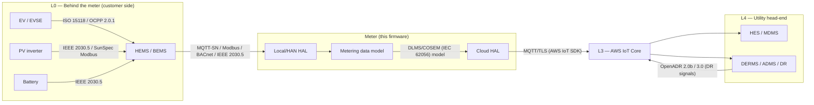
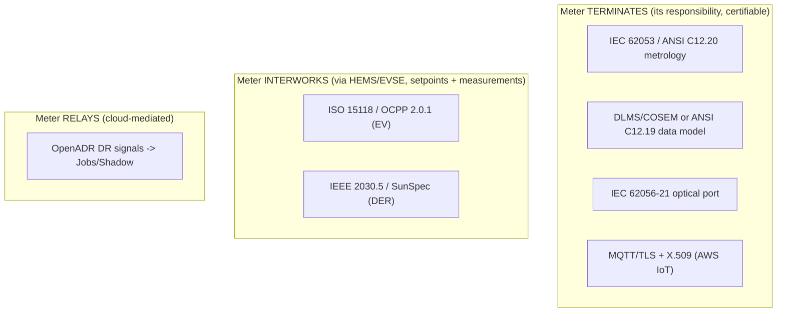

# 10 — Interoperability & Standards

The meter sits between three worlds that each have their own standards: the
**customer-side EV/DER devices** (L0), the **utility head-end** (L4), and the
**AWS IoT cloud** (L3). This document maps the protocols and standards the
firmware must speak or interwork with, and *where in the architecture each one
lives*. Getting this right is what makes the meter a real grid node rather than a
proprietary island — especially as EV chargers, inverters, and batteries
multiply.

---

## 1. The standards landscape, by interface

---

## 2. Standards table — what, where, why

| Standard | Domain | Where it lives in the firmware | Why it matters in the EV era |
|----------|--------|--------------------------------|------------------------------|
| **IEC 62052 / 62053**, **ANSI C12.20** | Metrology accuracy (MID classes) | Sealed metrology core ([02 §1](02-firmware-architecture.md)) | Revenue-grade accuracy under bidirectional, distorted EV loads |
| **DLMS/COSEM (IEC 62056)** | Meter data model & app protocol | Data-model HAL toward head-end ([08](08-data-model-shadow.md)) | Standard OBIS register identity; interop with utility MDMS |
| **ANSI C12.19 / C12.22** | Meter tables & transport (N. America) | Data-model HAL (regional profile) | North-American equivalent of the COSEM model |
| **IEC 62056-21 / ANSI C12.18** | Local **infrared/optical** port | Local HAL ([09 §4](09-hardware-platform.md)) | Field read / commissioning / offline fallback |
| **ISO 15118** | EV ↔ EVSE (Plug & Charge, smart charging) | Observed via HEMS/EVSE, not terminated on meter | Authenticated EV charging & V2G setpoints |
| **OCPP 2.0.1** | EVSE ↔ charge-management | Setpoints relayed through HEMS ([04 §3](04-ev-grid-complexity.md)) | Smart-charging profiles the meter's envelope maps onto |
| **IEEE 2030.5 (SEP2)** | DER ↔ utility (CSIP profile) | DER coordination via HEMS / cloud | The dominant DER/EV grid-integration profile (esp. US) |
| **SunSpec Modbus** | Inverter/battery registers | Local HAL (sub-metering attribution) | Reads PV/battery state for four-quadrant attribution |
| **OpenADR 2.0b / 3.0** | Demand-response signals | DR engine (L4) → Jobs/Shadow → DR Controller | Standard DR program signaling at fleet scale |
| **IEEE 1547 / UL 1741-SB** | DER interconnection & ride-through | Inverter/EVSE responsibility; meter verifies | Grid-support behavior the meter measures/attests |
| **Wi-SUN / IEEE 802.15.4g, PLC G3/PRIME** | Field-area mesh PHY | Comms HAL ([01 §3](01-grid-system-architecture.md)) | Concentrated residential backhaul |
| **MQTT 3.1.1 + TLS 1.2+, X.509** | Cloud connectivity | AWS IoT SDK ([05](05-aws-iot-integration.md)) | The managed-fleet transport |

---

## 3. Design principle — terminate the grid side, interwork the customer side

The meter **does not** try to be an EV charge controller or an inverter manager.
It draws a clean line:

- **Terminates** the revenue/grid-facing standards it is responsible for:
  metrology accuracy (IEC 62053/ANSI C12.20), the DLMS/COSEM (or ANSI C12.19)
  data model, the optical port, and MQTT/TLS to the cloud.
- **Interworks with** the customer-side standards (ISO 15118, OCPP, IEEE 2030.5,
  SunSpec) **through the HEMS/EVSE**, exchanging *setpoints and measurements*, not
  taking over their control loops ([04 §3–4](04-ev-grid-complexity.md)).
- **Relays** DR/grid-service intent: OpenADR signals arrive at the cloud, become
  **IoT Jobs/Shadow** state, and the meter executes/attests them.

This keeps the meter's certified, sealed, revenue-critical scope small and
auditable, while still letting it orchestrate a yard full of EVs and DERs.

---

## 4. Mapping standards onto the SDK

| Standard concern | SDK mechanism ([05](05-aws-iot-integration.md)) |
|------------------|--------------------------------------------------|
| COSEM register reads pushed to head-end | `coreMQTT` + `coreJSON`/CBOR telemetry |
| OpenADR DR event → device action | `jobs` (validated, audited, acknowledged) |
| IEEE 2030.5 DER config → meter policy | `device-shadow` desired/reported |
| Firmware to add a new protocol profile | `ota` (A/B signed update) |
| Device identity for ISO 15118 PKI alignment | `corePKCS11` + secure element ([06](06-security-architecture.md)) |

---

## 5. Regional profile note

The `gridProfile` setting ([03 §3](03-variant-configuration.md)) selects the
**regional standards stack**: e.g. `us-*` profiles lean on ANSI C12.19/22 +
IEEE 2030.5 (CSIP) + UL 1741-SB; `eu-*` profiles lean on DLMS/COSEM (IEC 62056) +
EN 50549 + MID. One firmware image carries both stacks and activates the right one
by profile — the same single-image strategy that drives the variant design.

Continue to [11 — Testing, Validation & Certification](11-testing-validation-certification.md).
