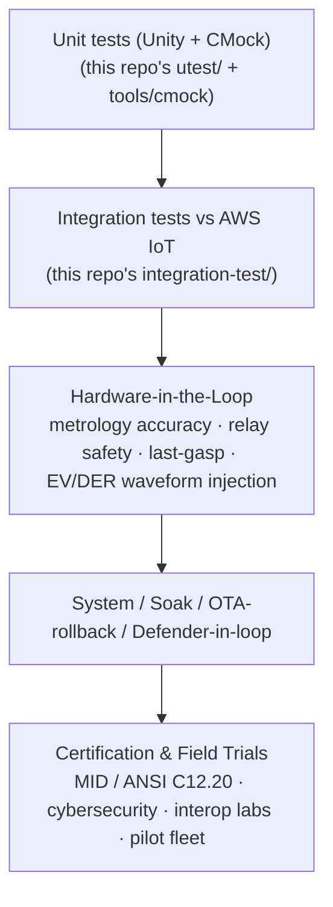
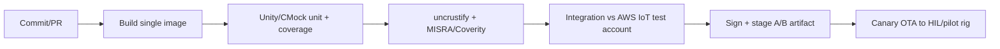

# 11 — Testing, Validation & Certification

A revenue meter that can disconnect service and shape grid load must be proven,
not just built. This document defines the **verification strategy** — from unit
tests up through hardware-in-the-loop, interoperability, and formal
certification — and grounds it in the **test infrastructure already present in
this repository** so the meter firmware reuses, rather than reinvents, the SDK's
proven harness.

---

## 1. The test pyramid

The wide base (unit) is fast and runs on every commit; the narrow top
(certification) is slow, expensive, and gates release. Effort is invested so that
**bugs are caught as low in the pyramid as possible.**

---

## 2. Reusing this repository's harness

| Layer | This repo provides | How the meter firmware uses it |
|-------|--------------------|--------------------------------|
| Unit | `utest/` dirs + `tools/cmock` (Unity + CMock) | Unit-test every HAL interface against **mock ports** (the `utest/mocks/` pattern from [09 §3](09-hardware-platform.md)); test middleware logic with mocked SDK |
| Integration | [`../integration-test/`](../integration-test) for MQTT/HTTP/Shadow vs real AWS IoT | Validate the meter's Shadow/Jobs/OTA/Defender flows against an AWS IoT test account |
| Static analysis | `tools/coverity` | MISRA + defect scan on the application code (the meter targets MISRA C, like the SDK — see `../MISRA.md`) |
| Style | `tools/uncrustify.cfg` | Consistent style across firmware + SDK |
| CI | [`../.github/workflows/ci.yml`](../.github/workflows/ci.yml) | Template for the meter's pipeline (build, unit, coverage, lint, static analysis) |

> The key reuse: because the firmware sits **on top of** the SDK and behind a
> mock-friendly HAL ([02 §2](02-firmware-architecture.md)), the *same* Unity/CMock
> approach used in `platform/posix/.../utest/` tests the meter's portable code
> with **no hardware required** in CI.

---

## 3. What each layer must prove

### Unit (every commit)
- Tariff/ToU binning, four-quadrant register math, demand-window calculation.
- Variant resolver precedence + schema validation ([03 §2](03-variant-configuration.md)).
- DR/V2G envelope validation and safety clamps ([06 §6](06-security-architecture.md)).
- HAL ports against mocks (transport, ota_pal, storage, metrology, clock).

### Integration (every PR / nightly, against AWS IoT)
- Shadow desired→apply→reported round-trip incl. `configError` rejection path.
- Jobs lifecycle for `dr.curtail`, `service.disconnect`, `ota`.
- OTA download + signature-verify + **A/B activate + rollback** ([07 §3](07-ota-and-lifecycle.md)).
- Defender metric publish and alarm trigger ([06 §5](06-security-architecture.md)).
- Reconnect/backoff behavior under induced network loss.

### Hardware-in-the-loop (release candidate)
- **Metrology accuracy** across the four quadrants with **injected EV/DER
  waveforms**: spiky L2/DC charging, PV export, V2G discharge, distorted/harmonic
  currents — the loads that legacy test plans omit ([04](04-ev-grid-complexity.md)).
- **Relay safety**: interlocks, no-close-into-fault, disconnect/reconnect timing.
- **Last-gasp**: brown-out → super-cap hold-up → final publish ([02 §7](02-firmware-architecture.md)).
- **Power-fail register integrity**: yank power mid-write, verify journaled
  registers are atomic and signed.

### System / soak
- Multi-week soak at interval cadence; clock discipline; memory-leak watch.
- **Fleet rollout simulation**: canary→staged→fleet OTA with backoff under load
  ([07 §2](07-ota-and-lifecycle.md)).
- Defender-in-the-loop: confirm anomalies (telemetry flood, unexpected egress)
  raise alarms and the Job-driven quarantine path works.

---

## 4. EV-era test cases that legacy plans miss

Because the design assumes EVs everywhere ([09](09-hardware-platform.md)), the
test plan explicitly exercises:

| Scenario | What it verifies |
|----------|------------------|
| Net-zero interval (PV exactly offsets load) | No double-count; correct near-zero net accounting |
| Rapid import↔export flips (V2G cycling) | Four-quadrant registers track direction changes cleanly |
| 19 kW charge start transient | Demand register + PQ event capture; metrology settling |
| Harmonic-rich charger current | Accuracy holds to class; THD logged ([04 §7](04-ev-grid-complexity.md)) |
| DR setpoint breach by a non-compliant EVSE | Load-limit backstop engages; compliance telemetry correct |
| Simultaneous fleet DR command | Staggering/rate-limit prevents synchronized feeder swing |
| Re-variant under live EV load | Registers seal at boundary, no energy lost ([03 §6](03-variant-configuration.md)) |

---

## 5. Interoperability validation

Per [10](10-interoperability-and-standards.md), interop is tested at the seams:
- **DLMS/COSEM / ANSI C12.19** conformance against the head-end/MDMS test tools.
- **IEEE 2030.5 / OCPP / SunSpec** interworking via a HEMS/EVSE simulator —
  verify setpoint relay and measurement attribution, not the chargers' own loops.
- **Optical port** read/commissioning against a standard IEC 62056-21 probe.
- **OpenADR → Jobs** translation in a DR-program test harness.

Certification-grade interop is repeated at accredited labs (e.g. utility AMI
interop and DER-integration test programs) before fleet rollout.

---

## 6. Formal certification gates (release blockers)

| Certification | Scope |
|---------------|-------|
| **MID (EU) / ANSI C12.20 (NA)** metrology accuracy | Revenue-grade accuracy, sealed metrology |
| **Type approval / pattern approval** (regional) | Legal-for-trade in target market |
| **Cybersecurity**: IEC 62443-4-x, ETSI EN 303 645, and AWS IoT/PSA alignment | Device & process security assurance |
| **EMC / safety**: IEC 61000, regional electrical safety | Field deployment |
| **Radio**: FCC / CE / regional | For cellular/RF/Wi-SUN modules |

Certification artifacts (test reports, signed images, calibration records) are
themselves tracked against firmware versions so each OTA release maps to its
approval evidence — closing the loop with the lifecycle in [07](07-ota-and-lifecycle.md).

---

## 7. CI pipeline shape

Modeled on [`../.github/workflows/ci.yml`](../.github/workflows/ci.yml); the
firmware adds the integration + sign + canary stages on top of the SDK's existing
build/test/lint flow.

Back to [README](README.md).
