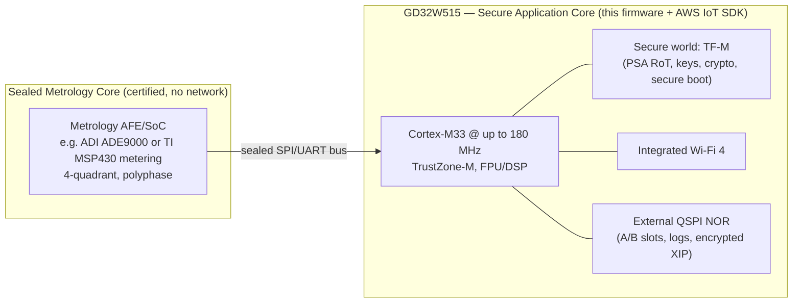
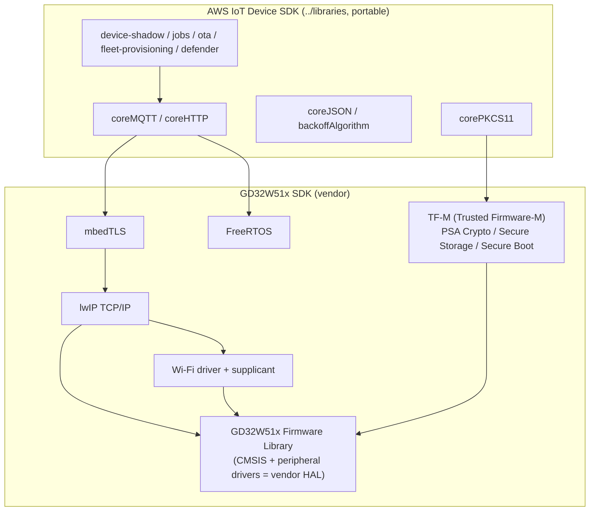
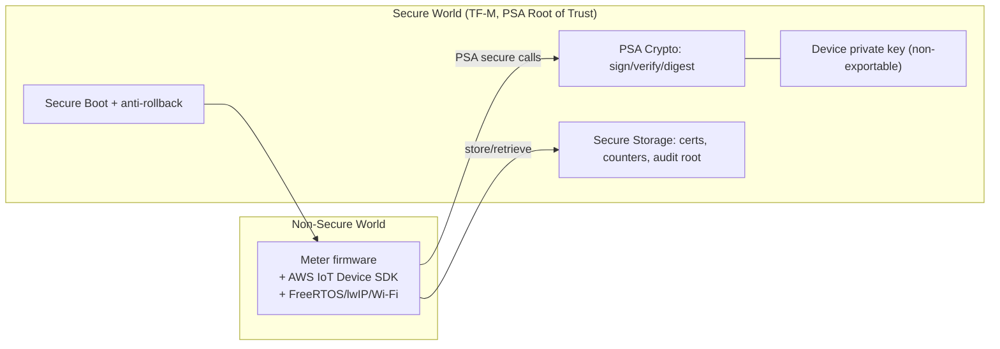

# 12 — Platform Revision B: GigaDevice GD32W515 (Cortex-M33)

**Revision note.** [09 — Hardware Platform & HAL](09-hardware-platform.md)
specified the *application-core class* (Cortex-M33 + TrustZone + PSA + hardware
crypto + A/B-OTA flash, second-sourceable). This document **instantiates that
class with a concrete part: the GigaDevice GD32W515**, and pins the software
stack to the **GD32W51x SDK**. The abstract design is unchanged; this is the
silicon and SDK binding.

> Specs below reflect the GD32W515 family as published by GigaDevice. Confirm
> exact figures (flash/SRAM per variant, crypto block list, temperature grade)
> against the current GD32W515 datasheet and user manual before a BOM commit.

---

## 1. Why the GD32W515 (from GigaDevice's portfolio)

GigaDevice's GD32 line spans Cortex-M3/M4/M23/M33. For a **secure, connected**
application core the Cortex-M33 options are the M33 family; within that, the
**GD32W515** is purpose-built for secure IoT connectivity and is the strongest
fit for this meter:

| Selection criterion ([09 §2](09-hardware-platform.md)) | GD32W515 |
|--------------------------------------------------------|----------|
| **Cortex-M33 + TrustZone-M (Armv8-M Mainline)** | Yes — up to 180 MHz, FPU + DSP |
| **Hardware crypto + secure-element-class path** | On-chip crypto accelerator (AES, SHA/HASH, TRNG) + PKCAU public-key engine (RSA/ECC); eFuse/OTP for root secrets |
| **Secure boot + image confidentiality** | Hardware secure boot; external-flash on-the-fly AES decryption (encrypted XIP) |
| **Flash for A/B OTA with growth margin** | Internal/stacked + external QSPI NOR — ample room for two slots + years of feature growth |
| **Connectivity for direct-to-cloud** | **Integrated 2.4 GHz Wi-Fi 4 (802.11 b/g/n)** MAC/baseband/RF |
| **Second-sourceable to the M33 class** | Behind the HAL ([§4](#4-mapping-the-hal-ports-onto-the-gd32w515)) it remains swappable with other M33 parts |

The integrated Wi-Fi is the deciding factor: it directly serves the
**direct-to-cloud topology** (Topology A, [01 §3](01-grid-system-architecture.md))
for residential and commercial meters without an external radio, while TrustZone +
hardware crypto cover the security surface that grows as EVs add control paths.

**Family variants** (pick by integration need): GD32W515P (discrete, external
flash), GD32W515T (smaller package), GD32W515M (module with stacked flash for a
compact BOM). The firmware is identical across them — only the storage port and
pinmap differ.

---

## 2. The dual-core split still holds — GD32W515 is the *application* core

The GD32W515 is **not** a metering AFE. The certified, sealed metrology core of
[02 §1](02-firmware-architecture.md) stays a separate device:

So the meter BOM is **GD32W515 (app) + a certified metrology AFE (sealed)**,
exactly the §2 recommendation of [09](09-hardware-platform.md), now with the
application core fixed.

---

## 3. Software stack — the GD32W51x SDK under the AWS IoT Device SDK

The GD32W515 ships with the **GD32W51x SDK**, whose components slot directly
beneath the AWS IoT Device SDK libraries in `../libraries/`:

| AWS IoT SDK need | Provided by GD32W51x SDK |
|------------------|--------------------------|
| TLS for `coreMQTT`/`coreHTTP` transport | **mbedTLS** over **lwIP** |
| Network sockets | **lwIP** on the integrated **Wi-Fi** driver/supplicant |
| RTOS tasks/queues/timers ([02 §4](02-firmware-architecture.md)) | **FreeRTOS** |
| `corePKCS11` crypto + key storage ([06](06-security-architecture.md)) | **TF-M PSA Crypto / Secure Storage** + hardware crypto accelerator |
| Secure boot + anti-rollback ([07 §3](07-ota-and-lifecycle.md)) | **TF-M secure boot (MCUboot-based)** + eFuse |
| Peripheral access (SPI to AFE, QSPI, GPIO, UART) | **GD32W51x Firmware Library** |

This is the same shape as the existing POSIX port in
`../platform/posix/transport/` (which pairs mbedTLS with PKCS#11) — the GD32W515
port swaps the POSIX sockets for lwIP/Wi-Fi and the software PKCS#11 for TF-M.

---

## 4. Mapping the HAL ports onto the GD32W515

Each HAL interface in [`reference-src/include/hal/`](reference-src/include/hal)
gets a GD32W515 port. Only these files change to move to/from another M33 part —
the [09 §3](09-hardware-platform.md) second-source seam:

| HAL interface | GD32W515 port binding |
|---------------|------------------------|
| `metrology_hal.h` | GD32W51x **SPI/UART** driver to the sealed AFE; seal verify via TF-M crypto |
| `crypto_hal.h` | **TF-M PSA Crypto** + hardware AES/HASH/PKCAU/TRNG; keys in Secure Storage/eFuse |
| `storage_hal.h` | GD32W51x **QSPI** NOR driver; journaled registers in a wear-leveled region; TF-M Secure Storage for the audit log root |
| `actuator_hal.h` | GD32W51x **GPIO/timer** for relay + load-limit; **UART** for the IEC 62056-21 optical port |
| Transport (`coreMQTT`) | mbedTLS + lwIP over the Wi-Fi driver |

A declaration-only port header showing these factory bindings is provided at
[`reference-src/ports/gd32w515/gd32w515_port.h`](reference-src/ports/gd32w515/gd32w515_port.h)
and is included in the build-check so the contract stays coherent.

---

## 5. TrustZone partitioning (security model on this part)

The GD32W515's TrustZone-M lets us realize the [06](06-security-architecture.md)
trust model **without necessarily adding a discrete secure element** (one can
still be added for higher assurance):

- The device private key lives in the **secure world / eFuse** and is used, never
  read — fulfilling the secure-element role of [06 §3](06-security-architecture.md).
- mTLS signing, revenue-record signing, and OTA image verification go through
  **PSA Crypto** backed by the hardware accelerator.
- The actuator/control path ([06 §6](06-security-architecture.md)) and billing
  registers are guarded by secure-world services the non-secure app cannot bypass.

---

## 6. EV-era headroom check

| [09 §1](09-hardware-platform.md) pressure | GD32W515 margin |
|-------------------------------------------|------------------|
| Faster metrology/PQ post-processing | 180 MHz M33 with DSP + FPU |
| Finer, more frequent telemetry | Integrated Wi-Fi 4 bandwidth; FreeRTOS multitasking |
| Meter as control point (DR/V2G) | TrustZone-isolated control services |
| Years of A/B OTA feature growth | External QSPI NOR sized generously |
| Expanding hostile threat surface | TrustZone + hardware crypto + secure boot + encrypted XIP |

For **concentrated/PLC topologies** (Topology B, [01 §3](01-grid-system-architecture.md))
where Wi-Fi isn't used, the same GD32W515 drives an external PLC/RF modem over
SPI/UART, or you second-source to a non-radio M33 — the firmware above the HAL is
unchanged.

---

## 7. What this revision changes

- **Adds** this document (12) and the GD32W515 reference port
  ([`reference-src/ports/gd32w515/`](reference-src/ports/gd32w515)).
- **Updates** [09 §2](09-hardware-platform.md) with a "selected application MCU"
  callout pointing here.
- **Does not change** the architecture, variant model, security model, or data
  contracts — they were written to be silicon-agnostic, and the GD32W515 slots in
  behind the existing HAL.

Back to [README](README.md).
