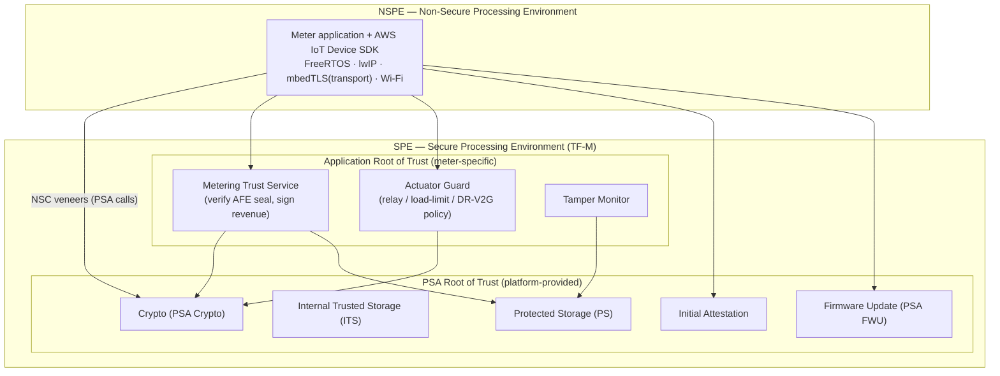
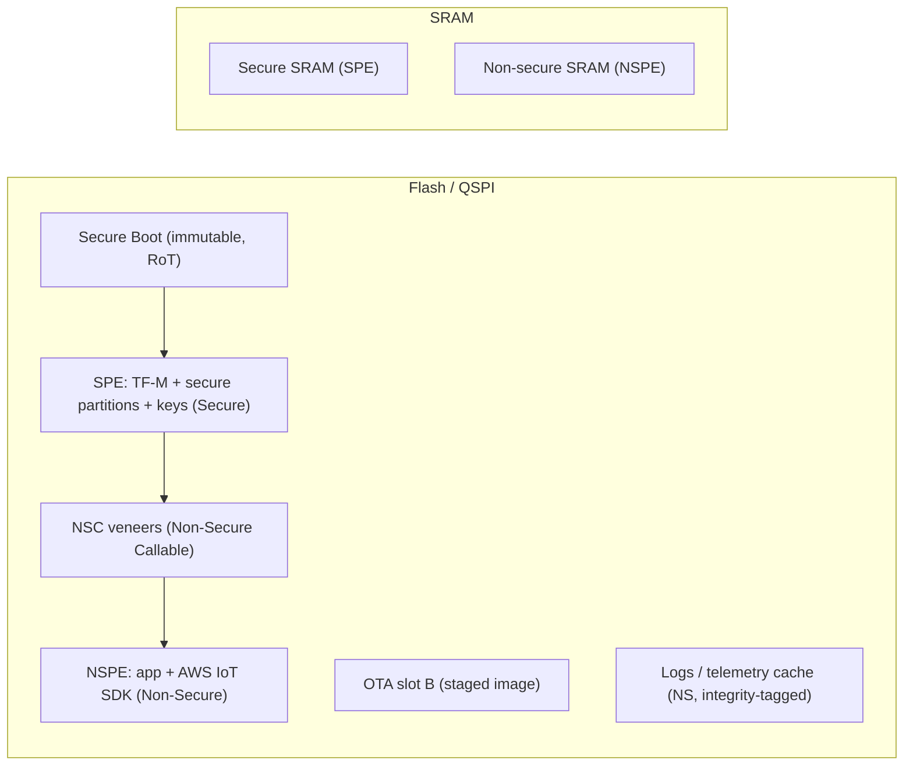
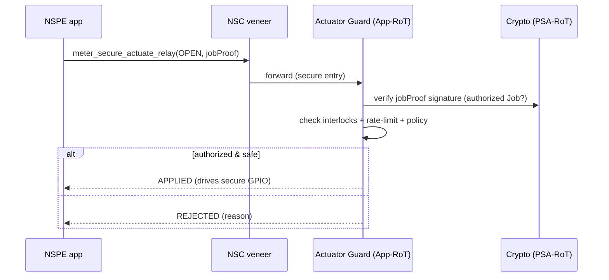

# 14 — TF-M Secure-Partition Layout & Grid Cybersecurity Standards

The GD32W515 runs **Trusted Firmware-M (TF-M)** in its secure world
([12 §5](12-gigadevice-gd32w515-platform.md)). This document defines the
**secure-partition layout**, the **memory partitioning** (TrustZone), the
**non-secure-callable (NSC) API** the meter app uses, and — critically — maps
every control to the **global grid / device cybersecurity standards** a metering
program must satisfy.

The governing principle is **defense in depth with a minimal trusted computing
base**: measurement integrity, device identity, and the actuator (relay/DR/V2G)
control path live in the **Secure Processing Environment (SPE)** so that even a
*fully compromised* non-secure application cannot forge revenue, impersonate the
device, or operate the relay outside policy.

---

## 1. Two worlds, three trust tiers

**Tier 1 — PSA Root of Trust** (from TF-M): crypto, sealed key storage, secure
storage, attestation, secure firmware update. **Tier 2 — Application Root of
Trust** (meter-specific secure partitions): the services that must be
incorruptible even though they are application logic. **Tier 3 — NSPE**: the bulk
of the firmware and all networking.

---

## 2. Secure partitions (what lives where, and why)

| Partition | Tier | Responsibility | Why it must be secure |
|-----------|------|----------------|------------------------|
| **Crypto** | PSA-RoT | Sign/verify/digest, mTLS key ops, TLS handshake secrets | Private keys never enter NSPE |
| **Internal Trusted Storage (ITS)** | PSA-RoT | Device private key, identity, RoT secrets | Hardware-bound, non-exportable |
| **Protected Storage (PS)** | PSA-RoT | Certs, config integrity tags, **anti-rollback counters**, audit-log root | Integrity + confidentiality, rollback resistance |
| **Initial Attestation** | PSA-RoT | Signed device attestation token (EAT) | Verifiable identity & boot state to the cloud |
| **Firmware Update (FWU)** | PSA-RoT | Secure boot, A/B activation, **anti-rollback** | Only signed, non-downgraded images run |
| **Metering Trust Service** | App-RoT | Verify metrology AFE seal; sign revenue records; hold billing-register integrity root | Revenue data is attested at the boundary; a compromised app cannot fabricate reads |
| **Actuator Guard** | App-RoT | Enforce relay/load-limit/DR/V2G **policy + interlocks + rate-limit**; only acts on authenticated Jobs | A compromised app (or forged command) cannot disconnect service or destabilize a feeder |
| **Tamper Monitor** | App-RoT | Latch & sign tamper events from secure GPIO/RTC | Tamper evidence cannot be suppressed by NSPE |

The **Metering Trust Service** and **Actuator Guard** are the meter-specific
heart of this design: they move *measurement integrity* and *control authority*
out of reach of the network-exposed application.

---

## 3. Memory partitioning (TrustZone)

The GD32W515's SAU (Security Attribution Unit) plus flash/RAM gating split the
address space. Representative layout (sizes are illustrative — size to the chosen
GD32W515 variant):

| Region | Attribute | Contents |
|--------|-----------|----------|
| Boot | Secure, immutable | Secure boot / root of trust |
| SPE flash | **Secure** | TF-M core + all secure partitions + ITS/PS roots |
| NSC | **Non-Secure Callable** | Veneer entry points (the only secure-entry gates) |
| NSPE flash | Non-Secure | Meter app + AWS IoT SDK + RTOS/lwIP/Wi-Fi |
| OTA slot B | Secure-controlled | Staged image, verified by FWU before swap |
| Logs/cache | Non-Secure | Store-and-forward records, each integrity-tagged by Crypto |
| Secure SRAM | Secure | SPE stacks/heaps, key material in use |
| NS SRAM | Non-Secure | App working memory |

Peripherals are attributed per [13 §3](13-gd32w515-peripheral-map.md): relay,
load-limit, tamper, and metrology SPI route to the secure side; Wi-Fi, optical,
and fieldbus stay non-secure.

---

## 4. The non-secure-callable (NSC) API

The non-secure app reaches the SPE **only** through a narrow set of veneers — the
single audited boundary. The compile-checkable contract is in
[`reference-src/include/secure/meter_secure_api.h`](reference-src/include/secure/meter_secure_api.h);
a TF-M partition manifest example is in
[`config-examples/tfm-meter-partitions.yaml`](config-examples/tfm-meter-partitions.yaml).

The app can *ask*; the secure world *decides*. Same pattern for revenue signing
(`meter_secure_sign_revenue`) and attestation (`meter_secure_get_attestation`).

---

## 5. Mapping to global grid & device cybersecurity standards

This layout is designed to evidence the controls that metering/grid programs are
audited against worldwide:

| Standard / regulation | Scope | How this layout satisfies it |
|-----------------------|-------|------------------------------|
| **IEC 62443-4-2 / -4-1** | Industrial component security + secure dev lifecycle | TCB isolation (SPE), least privilege, secure boot, signed update, defense-in-depth; -4-1 covered by the SDLC in [11](11-testing-validation-certification.md) |
| **IEC 62351** | Power-system comms security | mTLS + key protection in Crypto/ITS; integrity-tagged data; RBAC at the NSC boundary |
| **NIST IR 7628** (Smart Grid Cybersecurity) | Smart-grid logical security | Measurement integrity (Metering Trust Svc), command authenticity (Actuator Guard), key mgmt (ITS/PS) |
| **NISTIR 8259 / 8259A** | IoT device cybersecurity baseline | Device identity, secure config, data protection, software update, logging — all mapped to partitions |
| **NIST FIPS 140-3** | Cryptographic module validation | PSA Crypto + GD32W515 hardware crypto as the validated boundary |
| **NIST SP 800-82** | ICS security | Zones/conduits realized as SPE/NSPE + secure peripherals |
| **IEEE 1686** | IED cybersecurity capabilities | Audit log (signed, tamper-evident), access control, debug-port gating ([13 §3](13-gd32w515-peripheral-map.md)) |
| **ETSI EN 303 645** | Consumer IoT security | No default passwords, secure update, protected secrets, attack-surface minimization |
| **PSA Certified (L1–L3)** | Platform security assurance | TF-M PSA-RoT is the certification vehicle; targets PSA Certified Level 2+ |
| **EU RED Art. 3.3 (d/e/f) + Cyber Resilience Act** | EU radio + product cyber | Secure update, data/identity protection, vulnerability handling |
| **EU NIS2** | Operator-of-essential-services obligations | Device-side controls supporting the operator's posture (logging, identity, update) |
| **UK SMETS2 / GBCS / CPA** (where applicable) | UK smart-metering assurance | Strong device identity, signed commands, tamper evidence, key isolation |
| **NERC CIP** (bulk-system context) | Where the meter feeds BES operations | Supports asset identity, logging, and access control evidence |

> Certification is achieved by the **process + evidence** of [11](11-testing-validation-certification.md),
> not by architecture alone — but this partitioning is what makes the evidence
> achievable: the assets each standard cares about (keys, measurement, control,
> logs) are demonstrably isolated in the SPE.

---

## 6. Threat-to-control traceability

| Threat ([06 §1](06-security-architecture.md)) | Control in this layout |
|----------------------------------------------|------------------------|
| Tamper to under-report | Metering Trust Service attests AFE seal; signed registers in PS |
| Device cloning / impersonation | Non-exportable key in ITS; Initial Attestation token |
| Malicious / downgraded firmware | Secure boot + PSA FWU + anti-rollback counters in PS |
| Unauthorized mass disconnect | Actuator Guard: Job-signature check + interlocks + rate-limit in SPE |
| Forged DR/V2G setpoints | Actuator Guard validates against signed envelope before acting |
| Tamper-evidence suppression | Tamper Monitor latches/signs in SPE; NSPE cannot clear it |
| Network compromise of the app | Blast radius confined to NSPE; SPE assets remain protected |

Back to [README](README.md).
