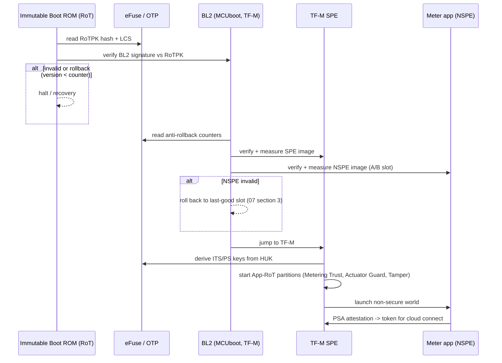

# 15 — TF-M + eFuse: Secure Boot & Key Provisioning

How the GD32W515's **one-time-programmable eFuse/OTP** anchors **Trusted
Firmware-M (TF-M)** secure boot, device identity, the PSA **lifecycle state
machine**, secure-debug gating, and anti-rollback. This is the hardware root that
makes the trust model of [06](06-security-architecture.md) and the secure
partitions of [14](14-tfm-secure-partition-layout.md) real, and it is the birth
half of the lifecycle in [07](07-ota-and-lifecycle.md).

> eFuse field names/sizes are **representative** of a PSA/TF-M provisioning
> scheme on a TrustZone-M part. Confirm the exact OTP map, fuse-locking, and
> secure-debug (ADAC) mechanism against the GD32W515 reference manual and the
> GD32W51x SDK / TF-M port before committing a provisioning line.

---

## 1. What the eFuse holds (and why OTP)

eFuse is **write-once, read-protected** storage fused at manufacture. It holds the
secrets and policy that must survive even a full firmware compromise and must be
**immutable** — exactly the root of trust:

| eFuse / OTP field | Purpose | Locked after |
|-------------------|---------|--------------|
| **RoTPK hash** | Hash of the Root-of-Trust public key used to verify the first mutable boot stage | PSA-RoT provisioning |
| **HUK** (Hardware Unique Key) | Per-device symmetric root; derives ITS/PS storage keys (never leaves SPE) | Chip manufacture |
| **IAK** seed / key | Initial Attestation Key for signed EAT tokens ([14 §4](14-tfm-secure-partition-layout.md)) | PSA-RoT provisioning |
| **Implementation ID / Instance ID** | Immutable device/SoC identity in attestation | PSA-RoT provisioning |
| **Lifecycle state (LCS)** | Monotonic device lifecycle (see §3) | progresses, never regresses |
| **Secure-debug auth key hash** | Public-key hash gating authenticated debug (ADAC) | PSA-RoT provisioning |
| **Anti-rollback counters** | Minimum allowed BL2 / SPE / NSPE image versions | increments only |
| **Provisioning flags** | Marks completion of each provisioning stage | per stage |

Keys derived from the **HUK** (not stored) protect Internal Trusted Storage and
Protected Storage, so the device private key and audit-log root are bound to
*this* silicon and unreadable if moved.

---

## 2. Secure boot chain (eFuse-anchored)



Each stage verifies the next against the **eFuse RoTPK** and the **anti-rollback
counters** before executing it — a measured, chained boot with no downgrade path.

---

## 3. PSA lifecycle state machine (driven by eFuse)

The LCS field advances **monotonically** through fused transitions; it can never
move backward, which is what gives auditable assurance of a device's state.

```mermaid
stateDiagram-v2
    [*] --> CM: chip manufacture (HUK fused)
    CM --> PROV: assembly & test
    PROV --> SECURED: PSA-RoT provisioning complete\n(RoTPK, IAK, debug key fused; debug locked)
    SECURED --> DECOMMISSIONED: end of life (RMA / retire)
    DECOMMISSIONED --> [*]
    note right of CM
      Debug open; HUK present.
      No field secrets yet.
    end note
    note right of SECURED
      Field state. Secure boot enforced,
      debug gated, keys provisioned.
    end note
```



| State | Debug | Secrets | Meaning |
|-------|-------|---------|---------|
| **CM** | open | HUK only | Bare silicon from the fab |
| **Assembly & Test (PROV)** | open | + test material | Board built, pre-secure provisioning |
| **SECURED** | **gated (ADAC) or closed** | + RoTPK, IAK, identity, claim cert | Field-deployable meter |
| **DECOMMISSIONED** | closed | zeroized/blocked | Retired; identity revoked ([07 §4](07-ota-and-lifecycle.md)) |

---

## 4. Factory key provisioning (the "birth" step)

```mermaid
sequenceDiagram
    participant LINE as Secure Provisioning Line (HSM-backed)
    participant DUT as GD32W515 (in PROV)
    participant EF as eFuse
    participant SPE as TF-M SPE

    LINE->>DUT: generate device keypair IN secure element
    DUT->>EF: (HUK already fused at CM)
    LINE->>EF: fuse RoTPK hash, IAK, Implementation/Instance ID
    LINE->>EF: fuse secure-debug auth key hash
    LINE->>SPE: store claim certificate in Protected Storage
    LINE->>EF: set provisioning flags; advance LCS -> SECURED
    Note over DUT,EF: fuses lock; debug now gated; image rollback floor set
```

- The device keypair is **generated inside the SPE**; the private key is sealed by
  HUK-derived keys in ITS and is **never exported** — satisfying
  [06 §3](06-security-architecture.md).
- Only the **claim certificate** is injected at the factory; the operational
  identity is issued later in the field (§5).
- Transition to **SECURED** is the irreversible gate after which the device
  enforces secure boot and gated debug.

---

## 5. Field identity provisioning (TF-M ↔ Fleet Provisioning)

The factory leaves a claim cert; first field boot upgrades to a unique
operational identity via **Fleet Provisioning** ([07 §1](07-ota-and-lifecycle.md)),
with all key material handled by TF-M:


CSR signing uses the SPE Crypto service, so the CSR is signed by the in-SE key
without that key ever entering the non-secure app or the network stack.

---

## 6. Secure-debug gating (ADAC)

Once in **SECURED**, the debug port (SWD, [13 §3](13-gd32w515-peripheral-map.md))
is not simply open:

- Debug requires an **authenticated-debug (ADAC)** challenge-response signed by a
  key whose public hash is fused in eFuse — only an authorized party (e.g. the
  utility/OEM with the debug credential) can unlock it.
- Debug unlock can be scoped (non-secure-only vs full) and is itself an auditable
  event. In **DECOMMISSIONED** the port is permanently closed.
- This satisfies the debug-port requirements of **IEEE 1686** and **IEC 62443**.

---

## 7. Anti-rollback

- The eFuse (or OTP-backed) **anti-rollback counters** record the minimum
  acceptable BL2/SPE/NSPE versions. Secure boot refuses any image below the floor.
- An OTA that fixes a vulnerability **raises the floor** once the new image is
  committed ([07 §3](07-ota-and-lifecycle.md)), so a downgrade attack cannot
  reintroduce the flaw — even with a validly-signed older image.

---

## 8. Standards mapping

| Standard | This eFuse/TF-M flow provides |
|----------|-------------------------------|
| **PSA Certified (L2/L3)** | Immutable RoT, HUK-bound storage, attestation, lifecycle, secure boot — the certification substance |
| **NIST FIPS 140-3** | Keys generated/held in the validated crypto boundary; non-exportable |
| **IEC 62443-4-2** | Hardware root of trust, secure boot, authenticated debug, rollback resistance |
| **NIST IR 7628 / NISTIR 8259A** | Device identity, secure update, protected secrets |
| **ETSI EN 303 645** | Unique per-device secrets (HUK), secure boot, no universal default credentials |
| **IEEE 1686** | Gated/authenticated debug, auditable security events |
| **EU CRA / RED Art. 3.3** | Secure-by-default boot, identity & update integrity, downgrade protection |

---

## 9. Decommissioning

At end of life ([07 §4](07-ota-and-lifecycle.md)): revoke the operational cert
cloud-side, have the SPE **zeroize** HUK-derived storage keys (rendering ITS/PS
unreadable), block re-provisioning, and advance LCS to **DECOMMISSIONED**. The
unit cannot be resurrected with its old identity.

The eFuse field map referenced here is provided as a compile-checked descriptor
at [`reference-src/include/secure/efuse_map.h`](reference-src/include/secure/efuse_map.h).

Back to [README](README.md).
