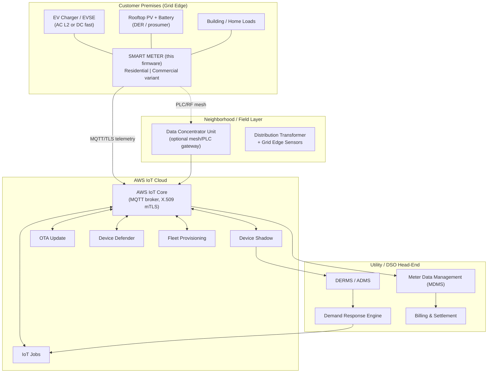

# Smart Electricity Meter — Firmware & Grid System Architecture

A complete firmware architecture for a connected electricity meter that ships in
two **firmware-configurable variants** — **Residential** and **Commercial** —
and is designed for the new grid complexity introduced by **electric vehicles
(EVs)**: bidirectional power flow, vehicle-to-grid (V2G), high-power AC/DC
charging, distributed energy resources (DER), dynamic pricing, and active demand
response.

The firmware is built on top of the **AWS IoT Device SDK for Embedded C**
(this repository). Every cloud-facing capability maps to a concrete SDK library
already vendored here — `coreMQTT`, `coreHTTP`, `coreJSON`, `corePKCS11`,
`backoffAlgorithm`, and the AWS services `Device Shadow`, `Jobs`, `OTA`,
`Fleet Provisioning`, `Device Defender`, and `SigV4`.

> This folder is **architecture documentation**, not compiled firmware. It is a
> blueprint: layered module design, RTOS task model, variant-configuration
> strategy, the meter's role as an IoT node in the wider grid, and the exact
> mapping onto the SDK libraries in `../libraries/`.

---

## How to read this

| # | Document | What it answers |
|---|----------|-----------------|
| 00 | **README** (this file) | Executive overview, glossary, the one-page picture |
| 01 | [Grid System Architecture](01-grid-system-architecture.md) | Where each IoT node lives in the grid, from meter → DSO → cloud |
| 02 | [Firmware Architecture](02-firmware-architecture.md) | Layered module design, RTOS task model, boot flow, memory |
| 03 | [Variant Configuration](03-variant-configuration.md) | How one image becomes Residential vs Commercial |
| 04 | [EV & Grid Complexity](04-ev-grid-complexity.md) | Bidirectional metering, V2G, demand response, dynamic tariffs |
| 05 | [AWS IoT Integration](05-aws-iot-integration.md) | Which SDK library serves which firmware responsibility |
| 06 | [Security Architecture](06-security-architecture.md) | Secure boot, identity, PKCS#11, TLS, Defender, key lifecycle |
| 07 | [OTA & Device Lifecycle](07-ota-and-lifecycle.md) | Provisioning, fleet rollout, A/B OTA, decommissioning |
| 08 | [Data Model & Device Shadow](08-data-model-shadow.md) | Telemetry schema, shadow documents, configuration contract |
| 09 | [Hardware Platform & HAL](09-hardware-platform.md) | MCU selection for the EV-saturated grid, HAL references, IR/optical port, billing channel |
| 10 | [Interoperability & Standards](10-interoperability-and-standards.md) | DLMS/COSEM, ISO 15118, OCPP, IEEE 2030.5, OpenADR — what the meter terminates vs interworks |
| 11 | [Testing, Validation & Certification](11-testing-validation-certification.md) | Test pyramid on this repo's harness, EV-era test cases, certification gates |

Diagrams are authored in [Mermaid](https://mermaid.js.org/) and render directly
on GitHub. Reusable config snippets live in [`config-examples/`](config-examples/),
and compile-checkable C interface contracts for the HAL and device services live
in [`reference-src/`](reference-src/) (run `make check`).

---

## One-page picture

---

## The meter as an IoT node — responsibilities at a glance

A modern meter is no longer a one-way register. As an IoT node it is
simultaneously a **sensor**, an **actuator**, and a **local controller**:

- **Sensor** — bidirectional energy & power quality metrology (import/export,
  per-phase, harmonics, voltage/frequency events), pushed as MQTT telemetry.
- **Actuator** — service connect/disconnect relay, load-limit enforcement, and
  (commercial) demand-response curtailment signals to building automation / EVSE.
- **Local controller** — edge logic for net-metering, tariff selection, V2G
  authorization windows, and last-gasp / first-breath outage reporting.
- **Managed fleet member** — identity, configuration, firmware, and health
  governed from the cloud via Shadow, Jobs, OTA, and Defender.

See [01-grid-system-architecture.md](01-grid-system-architecture.md) for the
full node taxonomy and message flows.

---

## Variant strategy in one paragraph

A **single firmware image** is built and signed once. At first boot — and at any
time thereafter via a Device Shadow desired-state change — the meter resolves a
`variant` setting (`residential` | `commercial`) plus a regional **tariff/grid
profile**. The variant selects which **feature modules** are activated (e.g.
single-phase vs polyphase metrology, presence of a demand register, V2G
authorization, CT/PT ratios), the **default sampling/reporting cadence**, and the
**data schema** published to the cloud. No separate build per variant; one image,
data-driven behavior, fleet-wide manageability. Details in
[03-variant-configuration.md](03-variant-configuration.md).

---

## Glossary

| Term | Meaning |
|------|---------|
| **AMI** | Advanced Metering Infrastructure — the meter + comms + head-end system |
| **DSO / DNO** | Distribution System Operator / Network Operator (runs the local grid) |
| **MDMS** | Meter Data Management System (validates, stores, estimates meter reads) |
| **HES** | Head-End System (collects from meters, talks to MDMS) |
| **DER** | Distributed Energy Resource (rooftop PV, home battery, EV) |
| **DERMS** | DER Management System (orchestrates DERs) |
| **ADMS** | Advanced Distribution Management System |
| **EVSE** | Electric Vehicle Supply Equipment (the charger) |
| **V2G / V2H** | Vehicle-to-Grid / Vehicle-to-Home (bidirectional EV power) |
| **DR** | Demand Response (load shaped in response to grid signals) |
| **ToU / RTP / CPP** | Time-of-Use / Real-Time Pricing / Critical-Peak Pricing tariffs |
| **DCU** | Data Concentrator Unit (aggregates many meters over PLC/RF) |
| **Last-gasp** | A meter's final message on loss of mains power (outage detection) |
| **MID / ANSI C12 / DLMS-COSEM / IEC 62056** | Metrology accuracy & data-model standards |
| **OCPP / IEEE 2030.5 / ISO 15118** | EV charging & DER interoperability protocols |
